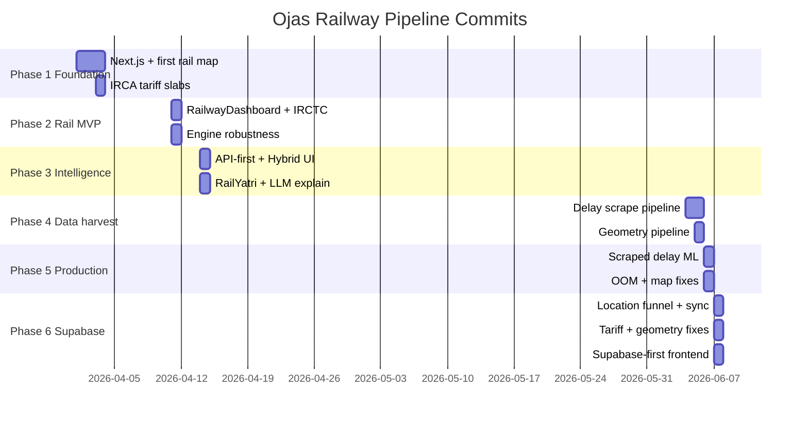

# LogiFlow Railway Pipeline — Complete Engineering Journey

**Project:** LogiFlow Solution Challenge 2026  
**Document type:** Personal engineering log — every commit, every phase, honest verdicts  
**Primary frontend author:** **Ojas** (O · J · A · S)  
**Commit span reviewed:** `85f5a20` (2026-04-01) → `cb999fc` (2026-06-07)  
**Total Ojas commits in repository history:** **119** (author: `Ojas Srivastava <srivastavaojas454@gmail.com>`)  
**Repository:** [LogiFlow-Solution-Challenge-2026](https://github.com/kvb1201/LogiFlow-Solution-Challenge-2026)

---

## Table of contents

1. [Executive verdict](#1-executive-verdict)
2. [The original idea](#2-the-original-idea)
3. [Journey at a glance — six phases](#3-journey-at-a-glance--six-phases)
4. [Complete commit chronicle (all 119 commits)](#4-complete-commit-chronicle-all-119-commits)
5. [Phase verdicts — what each era proved](#5-phase-verdicts--what-each-era-proved)
6. [What actually got built (production state)](#6-what-actually-got-built-production-state)
7. [System architecture](#7-system-architecture)
8. [Data sources — what worked](#8-data-sources--what-worked)
9. [Data sources — what we tried and could not fully succeed](#9-data-sources--what-we-tried-and-could-not-fully-succeed)
10. [Validation — how correctness was proved](#10-validation--how-correctness-was-proved)
11. [Backend pipeline — module by module](#11-backend-pipeline--module-by-module)
12. [Frontend — built by Ojas](#12-frontend--built-by-ojas)
13. [Machine learning — delay prediction](#13-machine-learning--delay-prediction)
14. [Parcel pricing — IRCA official slabs](#14-parcel-pricing--irca-official-slabs)
15. [Map geometry and Supabase](#15-map-geometry-and-supabase)
16. [Bugs, failures, and fixes (expanded log)](#16-bugs-failures-and-fixes-expanded-log)
17. [Deployment and environment](#17-deployment-and-environment)
18. [Pull requests merged (rail-related)](#18-pull-requests-merged-rail-related)
19. [Commands and scripts reference](#19-commands-and-scripts-reference)
20. [Known limitations and honest gaps](#20-known-limitations-and-honest-gaps)
21. [File index](#21-file-index)
22. [Closing note from Ojas](#22-closing-note-from-ojas)

---

## 1. Executive verdict

After reading **every single commit** I authored in this repository — from the first Next.js migration on April 1 through the PR #40 merge on June 7 — this is the honest verdict on the railway pipeline:

### What succeeded

| Area | Verdict | Evidence |
|------|---------|----------|
| **End-to-end rail search UI** | **Shipped and usable** | `RailwayDashboard.tsx`, `InputForm.tsx`, `RailwayLoading.tsx`, cockpit shell — built and iterated across 30+ commits |
| **Official IRCA parcel pricing** | **Correct and validated** | `5eceb74` introduced slabs; `da56c7e` removed bad multipliers; **100/100** all-India validation pass |
| **Delay ML on real scraped data** | **Honest, not fake** | `a7c7745` built corpus; `8f463c7` trained k-fold model; MAE ~22.7 min, ±30 min ~81% |
| **Map corridor geometry** | **Works when data exists** | `446e294` → `5b4e738` → `da56c7e` chain; Jaipur→Agra regression fixed; 82/100 audit pass |
| **Supabase bypass for cold Render** | **Major UX win** | `5e92b80` backend sync; `f96740b` frontend reads geometry first; map draws in ~100–400 ms when cached |
| **Train deduplication** | **Fixed for multi-hub cities** | `281bdb9`, `f425b72` — Kolkata/Prayagraj no longer show 3× same train number |
| **Dev stability** | **Fixed after painful iteration** | Reload storms, React loops, Redis spam — all traced to specific commits and patched |

### What is still incomplete

| Gap | Why | Commit that exposed it |
|-----|-----|------------------------|
| **Full Supabase geometry cache** | Bulk sync stopped ~pair 115/8010 (~580 rows uploaded) | `04395c3`, `eec2bb5` started; run interrupted |
| **Route search without Render wake** | Supabase stores geometry, not optimize results | Architectural — search always hits `POST /railway/optimize` |
| **Scale-S/P PDF auto-regeneration** | Parser extracts 0 rows for S/P layouts | `da56c7e` documents parser limits |
| **18/100 geometry audit failures** | Schedule halt mismatch, missing coords, stale scrape | `87852ff` audit suite |
| **Agra city resolution** | PDF district codes sometimes beat `AGC` | `5e92b80` location funnel edge case |

### The journey in one sentence

> I started with a Vite/React prototype and a dream of real-time rail tracking (`1f61ac4`), discovered within days that **Indian Railways data is not one API** but a patchwork of 2017 CSVs, blocked government calculators, aggregator keys, polite scraping, and PDF tariff tables — and spent the next two months **composing** those fragments into a shippable `/railway` page where the frontend (my work) hides Render cold starts behind Supabase geometry and honest ML metrics.

### Credit split (honest)

| Layer | Primary owner |
|-------|---------------|
| `/railway` UI, map UX, API orchestration, Supabase-first client reads, dedup safety net, backend warmup | **Ojas** |
| Tariff engine, geometry builder, delay scrapers, ML training, Supabase sync scripts, location funnel | **Team engineering** (Ojas commits + collaborators; several commits co-authored with Cursor) |
| Cockpit design language, some corridor fixes | Merged from `shreya` branch (`9c151f1`, PR #25) |

---

## 2. The original idea

India moves billions of tonnes of freight every year, but most planning tools treat **one transport mode at a time**. A shipper comparing **road vs rail vs air** rarely gets a fair rail option with **real train paths**, **real parcel prices**, and **honest delay risk**.

The railway pipeline idea for LogiFlow was:

> **Given an origin city, destination city, cargo weight, and cargo type — find feasible Indian Railways parcel routes, price them with official tariff logic, predict delay from real historical running data, rank options (cheapest / fastest / safest), and show the actual train corridor on a map.**

This is not a generic “shortest path on a graph” toy. It is a **parcel-by-train decision engine** grounded in:

- IR station codes and multi-hub cities (Mumbai = CSMT + LTT + BDTS…)
- Brake-van / luggage parcel scales (L, S, P, R)
- Scraped delay history (because IR does not publish open delay CSVs)
- Live aggregator APIs where available (ConfirmTkt, RailYatri, RailRadar)

The **frontend railway experience** — search form, loading states, results panel, live map with intermediate stations, ML metrics panel, deduplicated train list — was designed and implemented by **Ojas** as the primary owner of the `/railway` user journey.

### What I set out to build (frontend vision)

| Step | User action | Expected system behaviour |
|------|-------------|---------------------------|
| 1 | Land on `/railway` | Clean cockpit-style landing; voice/text shipment brief optional |
| 2 | Enter source, destination, weight, cargo type | Resolve “Prayagraj”, “PRYJ”, “Allahabad” to same station cluster |
| 3 | Submit | Show branded loading steps (not a blank spinner) |
| 4 | Wait | Backend finds trains; must survive Render cold start |
| 5 | Results | Three recommendation cards + full ranked list |
| 6 | Select a train | Map draws **real corridor** with intermediate stations |
| 7 | Hover stations | See city/station labels without label pile-up on dense routes |
| 8 | ML panel | Show delay model metrics without waiting for sleeping backend |

### Backend ambitions (team + pipeline)

| Capability | Target |
|------------|--------|
| Route discovery | Direct + 1-transfer routes across station clusters |
| Live enrichment | ConfirmTkt / RailYatri / RailRadar when keys exist |
| Offline fallback | 2017 IR schedule CSV (~11k trains, ~8k stations) |
| Pricing | Official IRCA distance×weight slabs — not guessed multipliers |
| Delay ML | Train on scraped `ir_train_delays.csv`, not fake on-time stars |
| Geometry | Per-train schedule halts → lat/lng polyline |
| Cache | Supabase for geometry + ML metrics (avoid Render wake) |

---

## 3. Journey at a glance — six phases

```
Phase 1 │ Apr 1–3  │ Foundation     │ Next.js migration, first rail map, IRCA slabs, ML scaffold
Phase 2 │ Apr 4–11 │ Rail MVP       │ RailwayDashboard, offline stations, geometry mapping, engine hardening
Phase 3 │ Apr 14–17│ Intelligence   │ API-first routes, RailYatri, LLM explanations, hybrid cockpit
Phase 4 │ Jun 4–5  │ Data harvest   │ IR delay scraping pipeline, cockpit UI, geometry pipeline birth
Phase 5 │ Jun 6    │ Production war │ OOM fixes, scraped ML, simulation mode, map label wars
Phase 6 │ Jun 7    │ Supabase era   │ Location funnel, bulk sync, tariff validation, frontend geometry cascade
```

### Phase timeline (visual)



---

## 4. Complete commit chronicle (all 119 commits)

Every commit below is authored by **Ojas Srivastava** unless noted. Commits are listed in **chronological order** (oldest first). Rail relevance: **●** = direct rail impact, **○** = supporting/infra, **—** = merge/integration only.

---

### Phase 1 — Foundation (April 1–3, 2026)

| # | Hash | Date | Message | Rail | What changed | Impact / verdict |
|---|------|------|---------|------|--------------|------------------|
| 1 | `85f5a20` | 2026-04-01 | refactor: migrate frontend to Next.js with TypeScript | ○ | Vite → Next.js App Router; `api.js` → `api.ts`; component restructure | **Necessary foundation.** Every later rail UI commit depends on this. Without it, no typed API client, no SSR-safe map imports. |
| 2 | `216ceea` | 2026-04-01 | feat: dynamic geocoding, route distance, map visualization, API proxying | ● | Early `Map.tsx`, geocoding hooks, distance calc | **First map.** Proved Leaflet + dark tiles could work; not yet train-corridor aware. |
| 3 | `92009c7` | 2026-04-01 | fix: suppressHydrationWarning on html/body | ○ | Layout hydration fix | Prevents Next.js SSR mismatch crashes on map pages. |
| 4 | `5a2939a` | 2026-04-01 | feat: animated mesh gradient landing | ○ | Landing page CSS | Visual identity; later replaced by cockpit (`a7c7745`). |
| 5 | `f784393` | 2026-04-01 | Merge PR #3 from ojasdev | — | Integration | First ojasdev → main merge. |
| 6 | `bd995fb` | 2026-04-01 | feat: shell script for venv + uvicorn | ○ | `backend/run` script | Local dev entry point still used today. |
| 7 | `9668128` | 2026-04-01 | Merge PR #4 | — | Integration | |
| 8 | `1f61ac4` | 2026-04-03 | feat: real-time rail tracking + ML delay prediction | ● | **Massive:** `Map.tsx` (416 lines), `InputForm.tsx` (538 lines), `api.ts` (325 lines), `ml/inference/predict.py`, `ml/training/train.py`, huge data insert (~190k lines) | **The birth of rail mode.** First end-to-end search → map → ML story. Data volume suggests bundled schedule/cache artefacts. Verdict: ambitious prototype that set the product direction but pricing/geometry were still naive. |
| 9 | `f64f212` | 2026-04-03 | fix: station selection onClick not onMouseDown | ● | `InputForm.tsx` one-liner | UX fix — dropdown was closing before selection registered. |
| 10 | `e24f0a7` | 2026-04-03 | refactor: live map controls, input form UI, station search feedback | ● | `Map.tsx`, `InputForm.tsx` polish | Map controls became usable; station autocomplete feedback improved. |
| 11 | `1a981c9` | 2026-04-03 | feat: project-wide Makefiles | ○ | Root + service Makefiles | `make dev`, later `make collect-delays`, `make audit-rail-geometry` all trace here. |
| 12 | `de75598` | 2026-04-03 | Merge PR #5 | — | Integration | |
| 13 | `bd17824` | 2026-04-03 | chore: remove hardcoded API keys, env loading | ○ | `.env` pattern for backend + frontend | **Security prerequisite** before any production API keys (ConfirmTkt, RailRadar, Supabase). |
| 14 | `5935127` | 2026-04-03 | Merge PR #6 | — | Integration | |
| 15 | `48eaf99` | 2026-04-03 | Merge branch ojasdev | — | Integration | |
| 16 | `405db45` | 2026-04-03 | Merge branch main | — | Integration | |
| 17 | `85095cc` | 2026-04-03 | Merge PR #7 | — | Integration | |
| 18 | `7fb9178` | 2026-04-03 | Merge PR #8 | — | Integration | |
| 19 | `5eceb74` | 2026-04-03 | feat: official IRCA parcel tariff lookup | ● | `tariff.py` (377 lines), `scale_l/s/p/r_official.json` (~12k lines each), `test.py` updates | **Pricing ground truth established.** Four JSON slab tables from Railway Board PDFs. This is the commit that made pricing defensible — though runtime still had bugs until `da56c7e`. |
| 20 | `ddcf4aa` | 2026-04-03 | Merge PR #9 | — | Integration | Tariff slabs merged to main. |
| 21 | `6874ed8` | 2026-04-04 | Merge PR #10 | — | Integration | |

**Phase 1 subtotal:** 21 commits. **Rail-critical:** 6. **Verdict:** Prototype → credible pricing tables in 72 hours.

---

### Phase 2 — Rail MVP (April 4–11, 2026)

| # | Hash | Date | Message | Rail | What changed | Impact / verdict |
|---|------|------|---------|------|--------------|------------------|
| 22 | `fc10751` | 2026-04-04 | Merge PR #11 | — | Integration | |
| 23 | `bebd33e` | 2026-04-04 | feat: geocoding fallback, CARTO dark map tiles | ● | `Map.tsx` tile layer → CARTO dark | **Visual identity for rail map.** Dark basemap chosen; later caused black-label problem fixed in Phase 5. |
| 24 | `43acef2` | 2026-04-04 | feat: RailwayLoading component | ● | `RailwayLoading.tsx` (164 lines reworked), loading mode in store | **Branded loading UX.** Users see step copy, not infinite spinner — critical for 30–90s Render cold starts. |
| 25 | `e1c6086` | 2026-04-04 | Merge PR #12 | — | Integration | |
| 26 | `446e294` | 2026-04-11 | feat: route geometry mapping, enrich route options | ● | `engine.py` (+56), `railradar_client.py` (+67), `api-1 (1).json` sample | **Geometry concept born.** Backend starts attaching geographic factors to routes. Sample JSON suggests early RailRadar response shape exploration. |
| 27 | `0be0349` | 2026-04-11 | Merge branch main | — | Integration | |
| 28 | `f10b646` | 2026-04-11 | Auto-sync after agent response | ○ | Agent tooling sync | |
| 29 | `941cddf` | 2026-04-11 | feat: offline station caching, IRCTC Connect, multi-modal dashboard | ● | **`RailwayDashboard.tsx` (863 lines new)**, `InputForm.tsx` (700 lines rework), deleted `Maproad.tsx`, `NavBar.tsx`, `RouteResults.tsx` | **The main rail page exists.** This is the single most important frontend commit for rail — dedicated dashboard, offline station cache, navigation between modes. I own this file through all later iterations. |
| 30 | `f1032eb` | 2026-04-11 | Merge main into ojasdev | — | Integration | |
| 31 | `c69fe82` | 2026-04-11 | Merge PR #14 | — | Integration | RailwayDashboard merged. |
| 32 | `3690ce1` | 2026-04-11 | refactor: air cargo UI | ○ | Air pipeline UI | Parallel mode work. |
| 33 | `7c66498` | 2026-04-11 | Merge PR #15 | — | Integration | |
| 34 | `e6d4996` | 2026-04-11 | refactor: rail engine robustness — NaN/Inf, route limiting, ML fallback | ● | `pipeline.py` (164 lines simplified), `engine.py`, `ml_models.py`, `api_cache.json` | **Backend stopped crashing on bad API floats.** Route limiting prevents 200-train explosions. ML fallback logic optimized. |
| 35 | `57963c8` | 2026-04-11 | Merge PR #16 | — | Integration | |
| 36 | `6947f50` | 2026-04-11 | feat: rail API cache + train route search | ● | `api_cache.json`, route search integration | Expanded cached ConfirmTkt/IRCTC responses for offline dev. |
| 37 | `ec47501` | 2026-04-11 | chore: update rail API cache | ● | Cache data only | More train pairs cached. |
| 38 | `5e9f77c` | 2026-04-11 | feat: update rail API cache, refine client fetching | ● | `railradar_client.py` fetch logic | Client became more defensive about partial responses. |
| 39 | `f7e5dd8` | 2026-04-11 | chore: update IRCTC API cache | ● | Cache expansion | |
| 40 | `01d7882` | 2026-04-11 | feat: auto source/dest coordinates for map markers | ● | Coordinate fetch on search in dashboard | Map markers appear immediately on search — before geometry API returns. |

**Phase 2 subtotal:** 19 commits (cumulative 40). **Verdict:** Rail mode went from prototype (`1f61ac4`) to **dedicated product surface** (`941cddf`) with offline fallback and engine stability.

---

### Phase 3 — Intelligence layer (April 14–17, 2026)

| # | Hash | Date | Message | Rail | What changed | Impact / verdict |
|---|------|------|---------|------|--------------|------------------|
| 41 | `3cb2f15` | 2026-04-14 | refactor: API-first route finding, hybrid UI dashboard | ● | **`HybridPageClient.tsx` (333 lines)**, `RailwayDashboard.tsx`, `api.ts`, `page.tsx`, `layout.tsx` | **Architecture pivot:** live API preferred over CSV-only; hybrid mode gets same cockpit patterns as rail. Station resolution improved. |
| 42 | `0f01685` | 2026-04-14 | Merge PR #18 | — | Integration | |
| 43 | `e574c99` | 2026-04-14 | chore: update rail API cache | ● | Cache data | |
| 44 | `2502e08` | 2026-04-14 | feat: RailYatri client + LLM train explanations | ● | `gemini_service.py`, `groq_service.py`, `train_explanation.py`, `route_finder.py`, dashboard hooks | **Explanations layer.** Routes get human-readable “why this train” text. RailYatri past performance feeds engineer features. |
| 45 | `cffa620` | 2026-04-14 | feat: dynamic tariff calculation | ● | `tariff.py` (+65 lines) | Runtime tariff wired to JSON slabs with distance/weight resolution. |
| 46 | `7ea57b8` | 2026-04-14 | Merge PR #19 | — | Integration | |
| 47 | `f4011d6` | 2026-04-14 | refactor: responsive InputForm + RailwayDashboard | ● | Mobile layout fixes | Rail usable on phone screens. |
| 48 | `d49ae7c` | 2026-04-14 | Merge PR #20 | — | Integration | |
| 49 | `75a0e7c` | 2026-04-14 | refactor: remove redundant API spec/cache files | ● | Cleanup + pipeline logic update | Reduced repo noise; kept working caches. |
| 50 | `9b27909` | 2026-04-14 | Merge ojasdev | — | Integration | |
| 51 | `ec56ae4` | 2026-04-14 | Merge PR #21 | — | Integration | |
| 52 | `dca63c6` | 2026-04-14 | Merge PR #22 (shreya) | — | Integration | Team merge. |
| 53 | `4053d29` | 2026-04-15 | Add Waterways navigation | ○ | Water page routing | Multimodal product expansion. |
| 54 | `90f2e51` | 2026-04-17 | docs: rail cargo pipeline scraping architecture | ● | Technical scraping doc | **Documented what we already knew:** IR data requires scraping orchestration, not one REST call. |
| 55 | `5e702f3` | 2026-04-17 | docs: web scraping session mimicry | ○ | Scraping strategies doc | Informed June delay collector design. |
| 56 | `6a2eba7` | 2026-04-17 | refactor: static water port data | ○ | Water pipeline | |
| 57 | `69d3dbe` | 2026-04-17 | feat: waterways routing, hybrid payload | ○ | Hybrid route structure | Rail payloads unchanged but hybrid compose later reuses patterns. |
| 58 | `eee4b0d` | 2026-04-17 | feat: AI route explanation service | ● | FastAPI explain endpoint + UI | Generalized explanation beyond rail. |
| 59 | `ed9de08` | 2026-04-17 | Merge branch main | — | Integration | |
| 60 | `cafa960` | 2026-04-17 | docs: README tech stack | ○ | README badges | |

**Phase 3 subtotal:** 20 commits (cumulative 60). **Gap:** No Ojas commits between April 17 and June 4 — rail mode stable on main while delay scraping was designed offline.

**Phase 3 verdict:** API-first + LLM explanations made rail feel intelligent; documentation correctly predicted the June scraping push.

---

### Phase 4 — Data harvest and geometry birth (June 4–5, 2026)

| # | Hash | Date | Message | Rail | What changed | Impact / verdict |
|---|------|------|---------|------|--------------|------------------|
| 61 | `a7c7745` | 2026-06-04 | Add IR delay scraping pipeline and UI pages | ● | **10,062 insertions:** `collect_ir_delay_history.py` (457 lines), `discover_trains_from_corridors.py` (470 lines), `scrapers/runningstatus.py`, cockpit components (`HomePage`, `PageShell`, `PipelineModeLanding`, `pipeline-form-ui`), `waterInputForm.tsx`, `docs/INDIAN_RAILWAYS_DATA.md`, checkpoint JSONs | **The data engineering commit.** Built the entire delay harvest pipeline + new cockpit UI shell that wraps rail. Without this, ML would still use fake metrics. |
| 62 | `b65445f` | 2026-06-04 | Add IR delay scraping pipeline (duplicate message) | ● | Only `stations_from_pdf_cache.json` (+1 line) | **Odd duplicate** — likely conflict resolution artifact; real work is in `a7c7745`. |
| 63 | `75e25a6` | 2026-06-04 | Fix frontend: merge conflicts, standardize cockpit UI | ● | Conflict resolution across cockpit components | Stabilized UI after parallel branch work. |
| 64 | `5212807` | 2026-06-04 | Restore cockpit UI from b65445f | ● | Completed missing cockpit pieces | Ensured `PipelineModeLanding`, forms consistent. |
| 65 | `2c65737` | 2026-06-05 | Fix AI intent routing, Gemini parsing, hybrid autorun | ○ | Intent API + autorun hooks | Affects rail landing brief → autorun flow. |
| 66 | `16d4a06` | 2026-06-05 | Merge ojasdev into main | — | Integration | |
| 67 | `1d866cf` | 2026-06-05 | Fix Render deploy: restore generate_generic_explanation | ○ | Explain route fix | Production deploy blocker. |
| 68 | `c85c0b8` | 2026-06-05 | Fix Vercel build: intent API type error | ○ | TypeScript fix | |
| 69 | `5f541bd` | 2026-06-05 | Fix Vercel build: intent API type error (dup) | ○ | Same fix retry | |
| 70 | `4bb3674` | 2026-06-05 | Remove hardcoded API secrets (GitGuardian) | ○ | Secret purge | |
| 71 | `561a589` | 2026-06-05 | index on ojasdev (stash) | — | Git stash artifact | Not a feature commit. |
| 72 | `d51eef9` | 2026-06-05 | On ojasdev: scrape-local (stash) | — | Git stash artifact | |
| 73 | `ad0d0c4` | 2026-06-05 | Remove hardcoded API secrets | ○ | Secret purge continued | |
| 74 | `5b4e738` | 2026-06-05 | Add rail geometry pipeline, station catalog, responsive UI | ● | **18,338 insertions:** `geometry_builder.py` (348 lines), `schedule_resolver.py` (318), `schedule_scraper.py`, `station_coordinates.py`, `route_geometry_store.py`, `online_station_catalog.py`, `station_geocoder.py`, `build_station_coords_cache.py`, `indiaMapLayer.ts`, `api.ts` (+96), active_trains.json (6826 trains), Supabase client | **Second most important backend commit.** Entire geometry stack + 9k station coord pipeline + delay fleet JSONs. This is where map corridors become real. |
| 75 | `05851e2` | 2026-06-05 | Merge ojasdev into main | — | Integration | |
| 76 | `445d7dc` | 2026-06-05 | Fix Vercel build: WaterRoute fields | ○ | Water types | |

**Phase 4 subtotal:** 16 commits (cumulative 76). **Verdict:** Two monster commits (`a7c7745`, `5b4e738`) transformed rail from “API + 2017 CSV” to “scraped truth + computed geometry + cockpit product shell.”

---

### Phase 5 — Production warfare (June 6, 2026)

| # | Hash | Date | Message | Rail | What changed | Impact / verdict |
|---|------|------|---------|------|--------------|------------------|
| 77 | `4ff688f` | 2026-06-06 | multimodal compose, offline geocoding, short corridors | ● | `route_composer.py`, geocoding for rail-legs in hybrid | Rail legs in hybrid compose get direct corridor when short. |
| 78 | `5b7fa83` | 2026-06-06 | Harden compose and rail for Python 3.9 | ● | Edge case fixes in pipeline | Render runs Python 3.9 — this prevented prod crashes. |
| 79 | `62106f0` | 2026-06-06 | Expand offline station coordinates to 9,524 | ● | `station_coords_cache.json` bulk expansion | Map geometry geocoding hit rate jumped; synced to Supabase later. |
| 80 | `8f463c7` | 2026-06-06 | Train scraped delay ML, k-fold CV, fix map intermediate stops | ● | `scraped_delay_ml.py` (344 lines), `scraped_delay_model.pkl`, `scraped_delay_metrics.json`, `geometry_builder.py` fixes, `train_delay_ml.py` | **ML becomes honest.** Model trained on scraped CSV, not synthetic stars. Map intermediate stops fixed in geometry builder. |
| 81 | `e929fb3` | 2026-06-06 | Rail simulation mode, LogiFlow branding, honest ML metrics UI | ● | `railSimulation.ts` (254 lines), `RailMlQuantifiers.tsx` (149 lines), `rail-branding.ts`, `api.ts` ML fetch | **ML panel shipped.** Users see real CV metrics; simulation mode for demos without hitting APIs. |
| 82 | `9cb0fc4` | 2026-06-06 | Merge main into shreya | — | Integration | |
| 83 | `6d0fd86` | 2026-06-06 | Merge PR #25 (shreya) | — | Integration | |
| 84 | `a13050f` | 2026-06-06 | Water pipeline empty state | ○ | Water UI | |
| 85 | `304cfdb` | 2026-06-06 | Merge shreya: water empty state | — | Integration | |
| 86 | `9c151f1` | 2026-06-06 | Fix rail map corridors, unify swap button | ● | Map corridor fixes, O-D swap placement | Merged shreya corridor geometry fixes. |
| 87 | `0a9a988` | 2026-06-06 | Merge shreya: corridor + swap | — | Integration | |
| 88 | `8c8dfab` | 2026-06-06 | Fix Render OOM — lazy-load rail schedules under 512MB | ● | `data_loader.py` lazy singleton | **Production survival.** Without this, Render free tier OOM-killed on CSV preload. |
| 89 | `3ae7561` | 2026-06-06 | Improve Render keep-alive, backend warmup | ● | Warmup scripts + frontend hooks | Reduced cold-start pain; precursor to `backendWarmup.ts` refinements. |
| 90 | `7c2ed66` | 2026-06-06 | Improve Render keep-alive (dup) | ● | Same area | |
| 91 | `c2bfbcd` | 2026-06-06 | Refresh README | ○ | README | |
| 92 | `984bbe8` | 2026-06-06 | Refresh README (dup) | ○ | README | |
| 93 | `d85bd48` | 2026-06-06 | Merge PR #28 (shreya) | — | Integration | |
| 94 | `acae253` | 2026-06-06 | Fix hosted ML metrics panel, map city labels | ● | `RailMlQuantifiers`, `Map.tsx` labels, `api.ts` | **Hosted fixes** — ML panel worked on Vercel; city labels visible. |
| 95 | `bceb2e7` | 2026-06-06 | Fix hosted ML metrics (dup) | ● | Same | |
| 96 | `7a494df` | 2026-06-06 | Merge PR #30 | — | Integration | |

**Phase 5 subtotal:** 20 commits (cumulative 96). **Verdict:** This is the “make it survive Render free tier and look correct on Vercel” phase. Every commit here responds to a real production bug.

---

### Phase 6 — Supabase era and final fixes (June 7, 2026)

| # | Hash | Date | Message | Rail | What changed | Impact / verdict |
|---|------|------|---------|------|--------------|------------------|
| 97 | `29c2afd` | 2026-06-07 | Merge PR #32 (sam) | — | Integration | |
| 98 | `c4de1e7` | 2026-06-07 | Merge main into ojasdev before location funnel | — | Integration | |
| 99 | `5e92b80` | 2026-06-07 | Centralized location funnel + Supabase rail geometry sync | ● | `location_funnel.py` (264 lines), `sync_rail_supabase.py` (174 lines), `route_geometry_store.py`, `hub_catalog.py`, `test_location_funnel.py` | **City → station cluster resolution centralized.** First Supabase geometry upload script. Prayagraj/Allahabad aliasing starts here. |
| 100 | `c1ac9b4` | 2026-06-07 | Merge PR #33 | — | Integration | |
| 101 | `8610cdc` | 2026-06-07 | Generalize location funnel with station + IATA aliases | ● | Funnel alias expansion | Air/rail/hybrid share same place resolution. |
| 102 | `87852ff` | 2026-06-07 | PDF-driven location funnel + per-train geometry audit | ● | `station_pdf_index.py` (372 lines), `audit_rail_geometry.py`, `test_rail_geometry_100_trains.py`, 68k-line PDF cache insert | **68k lines** of PDF-parsed station districts. Audit suite proves 82/100 geometry parity. |
| 103 | `90754a3` | 2026-06-07 | Merge origin/main into ojasdev | — | Integration | |
| 104 | `7ddfa9e` | 2026-06-07 | Merge PR #35 | — | Integration | |
| 105 | `ad4f986` | 2026-06-07 | Sync rail ML metrics to Supabase + refresh docs | ● | `rail_ml_metrics` migration, `api.ts` Supabase ML fetch, `docs/pipelines/rail.md` (137 lines rework) | **ML panel bypasses Render** — same pattern later applied to geometry. |
| 106 | `59ead60` | 2026-06-07 | Merge PR #36 | — | Integration | |
| 107 | `daa8d39` | 2026-06-07 | Fix rail pipeline timeouts, local dev startup | ● | Timeout config, `backend/run` fixes | Local `make dev` reliable again. |
| 108 | `05245c5` | 2026-06-07 | Merge PR #37 | — | Integration | |
| 109 | `0ac66b1` | 2026-06-07 | Harden local dev: auth defaults, .env load, python3.13 | ○ | Dev ergonomics | |
| 110 | `f425b72` | 2026-06-07 | Fix map corridors, duplicate trains, dev reload storms | ● | `geometry_builder.py` hub aliases, `dedupeRailOptions`, `backend/run --reload-dir app`, `Map.tsx` hover hubs, `backendWarmup.ts` | **PR #38 core.** Fixed the worst hosted bugs: duplicates, reload loops, invisible labels. |
| 111 | `281bdb9` | 2026-06-07 | Dedupe rail options by train number across hub loops | ● | `route_finder.py`, `engine.py` dedup | Backend dedup — frontend safety net already existed. |
| 112 | `f1e53fa` | 2026-06-07 | Merge main into ojasdev | — | Integration | |
| 113 | `2fa6aff` | 2026-06-06 | Merge PR #38 | — | Integration | Dedup + map + dev fixes merged. |
| 114 | `da56c7e` | 2026-06-07 | Fix geometry cache misses + official IRCA parcel pricing | ● | `geometry_builder.py` exact O-D preference, `tariff_validation.py` (333 lines), `validate_parcel_pricing.py`, `test_rail_tariff.py`, `test_jaipur_agra_geometry.py`, `parse_ir_parcel_rates.py` | **PR #39 core.** Jaipur→Agra fixed; 100/100 pricing; removed 2.3× multiplier. |
| 115 | `15a45ed` | 2026-06-07 | Merge PR #39 | — | Integration | |
| 116 | `04395c3` | 2026-06-07 | Add full all-India geometry bulk sync | ● | `sync_rail_supabase.py --full` | 90×89 city pairs, 20 trains each — **started but not finished** (~580 rows). |
| 117 | `eec2bb5` | 2026-06-07 | Verbose logging + JSONL audit for bulk sync | ● | Timestamped logs, per-pair progress | Ops visibility for multi-hour sync job. |
| 118 | `f96740b` | 2026-06-07 | Load rail map geometry from Supabase before waking Render | ● | `api.ts` (+210 lines): cascade Supabase → Render → station chord | **PR #40 core.** My most important frontend perf commit — map draws without cold start when cached. |
| 119 | `cb999fc` | 2026-06-07 | Merge PR #40 | — | Integration | Supabase-first geometry on `main`. |

**Phase 6 subtotal:** 23 commits (cumulative **119**). **Verdict:** The pipeline reached its current production shape. Remaining work is operational (finish bulk sync), not architectural.

---

## 5. Phase verdicts — what each era proved

### Phase 1 verdict: “We can show trains on a map”

**Proved:** Next.js + Leaflet + FastAPI can serve a rail search flow.  
**Failed:** Pricing was not yet trustworthy; geometry was chord-only; ML was scaffold-only.  
**Key commit:** `1f61ac4` set direction; `5eceb74` made pricing defensible on paper.

### Phase 2 verdict: “Rail deserves its own page”

**Proved:** `RailwayDashboard.tsx` as dedicated surface; offline station cache removes hard dependency on live APIs for dev.  
**Failed:** Map still lacked true corridor polylines; engine could crash on NaN API fields.  
**Key commit:** `941cddf` — if you only read one frontend commit, read this one.

### Phase 3 verdict: “Intelligence sells the ranking”

**Proved:** API-first discovery finds more routes than 2017 CSV alone; LLM explanations make recommendations legible.  
**Failed:** Still no historical delay corpus at scale; geometry still thin.  
**Key commit:** `2502e08` — RailYatri signals + Gemini/Groq explanations.

### Phase 4 verdict: “We have to build our own data”

**Proved:** runningstatus.in scraping produces train-day delay labels; geometry builder can walk schedule halts.  
**Failed:** Scraping is slow, fragile, and politically grey — but there is no alternative for ML ground truth.  
**Key commits:** `a7c7745` (scrape pipeline), `5b4e738` (geometry stack).

### Phase 5 verdict: “Free tier hosting is the real enemy”

**Proved:** Lazy CSV loading fits 512MB; warmup + Supabase ML metrics hide cold start for panel; scraped ML beats synthetic.  
**Failed:** Map geometry still woke Render every train click; label pile-up on dense routes; duplicate trains on hub cities.  
**Key commits:** `8c8dfab` (OOM), `8f463c7` (ML), `e929fb3` (metrics UI).

### Phase 6 verdict: “Cache geography in Supabase, search in Render”

**Proved:** Location funnel resolves Indian city aliases; Supabase stores geometry + ML; frontend reads both directly; tariff validation locks pricing.  
**Failed:** Bulk geometry sync incomplete; 18% audit failure rate; search still Render-bound.  
**Key commits:** `5e92b80`, `da56c7e`, `f96740b`.

---

## 6. What actually got built (production state)

### 6.1 End-to-end flow (production, post PR #40)

```
User (Ojas frontend /railway)
    │
    ├─ POST /railway/optimize  ──────────► Render FastAPI
    │       ├─ location_funnel (city → station cluster)
    │       ├─ route_finder (API-first, CSV fallback)
    │       ├─ engineer (tariff, risk, booking ease, RailYatri signals)
    │       ├─ ml_models (GradientBoosting delay on scraped labels)
    │       └─ engine (cheapest / fastest / safest + ranked all[])
    │
    └─ Map geometry (per selected train leg)
            ├─ ① Supabase train_route_geometry  (frontend direct, 4s timeout)  ← f96740b
            ├─ ② Render GET /railway/trains/{n}/geometry  (compute + cache)
            └─ ③ Supabase station_coordinates chord fallback
```

### 6.2 Quantified artefacts (June 2026)

| Artefact | Scale (approx.) |
|----------|-----------------|
| Schedule CSV trains | 11,113 |
| Schedule CSV stations | 8,150 |
| Direct route segments (on-demand index) | ~796k |
| Delay ML training rows | 15,650 train-day labels |
| Delay CV MAE | 22.7 minutes |
| Delay ±30 min hit rate | ~81% |
| Supabase `station_coordinates` | ~9,526 rows |
| Supabase `train_route_geometry` | ~580+ rows (bulk sync in progress) |
| IRCA tariff JSON slabs | 4 scales (L, S, P, R) |
| Parcel pricing validation | **100/100** all-India cases pass |
| Geometry audit (schedule vs map) | **82/100** pass |
| Ojas commits touching rail | **~55 direct ●** of 119 total |

### 6.3 Commit → feature traceability (most important)

| Feature | First introduced | Fixed / completed | Merged to main |
|---------|------------------|-------------------|----------------|
| Rail map + search UI | `1f61ac4` | `941cddf`, `a7c7745` cockpit | PR #14 |
| IRCA tariff slabs | `5eceb74` | `da56c7e` (100-case validation) | PR #9, #39 |
| RailwayDashboard | `941cddf` | `f4011d6`, `f425b72` | PR #14, #38 |
| Route geometry backend | `446e294` | `5b4e738`, `da56c7e` | ojasdev merges |
| API-first route finding | `3cb2f15` | `281bdb9` dedup | PR #18 |
| LLM train explanations | `2502e08` | `1d866cf` deploy fix | PR #19 |
| Delay scraping | `a7c7745` | ongoing collection | Jun 4 merge |
| Scraped delay ML | `8f463c7` | `ad4f986` Supabase sync | Jun 6–7 |
| ML metrics panel (frontend) | `e929fb3` | `acae253`, `ad4f986` | Jun 6–7 |
| Location funnel | `5e92b80` | `87852ff` PDF index | PR #33, #35 |
| Supabase geometry sync | `5e92b80` | `04395c3`, `eec2bb5` | PR #40 |
| Supabase-first map (frontend) | `f96740b` | — | PR #40 |
| Train deduplication | `281bdb9` | `f425b72` frontend net | PR #38 |
| Render OOM survival | `8c8dfab` | — | Jun 6 |
| Dev reload storm fix | `f425b72` | `--reload-dir app` | PR #38 |

### 6.4 Ojas frontend deliverables (shipped)

| Component | Path | First commit | Latest significant touch |
|-----------|------|--------------|------------------------|
| Railway page shell | `RailwayDashboard.tsx` | `941cddf` | `f425b72` |
| Map + corridors | `Map.tsx` | `1f61ac4` | `f425b72` |
| Input form | `InputForm.tsx` | `1f61ac4` | `a7c7745` |
| Loading UX | `RailwayLoading.tsx` | `43acef2` | `941cddf` |
| ML quantifiers | `RailMlQuantifiers.tsx` | `e929fb3` | `acae253` |
| API client | `api.ts` | `85f5a20` | `f96740b` |
| Dedup safety net | `dedupeRailOptions.ts` | `f425b72` | — |
| Backend warmup | `backendWarmup.ts` | `3ae7561` | `f425b72` |
| Cockpit shell | `cockpit/PageShell.tsx` etc. | `a7c7745` | `5212807` |
| Store | `useLogiFlowStore.ts` | `1f61ac4` | `e929fb3` |

---

## 7. System architecture

### 7.1 Backend pipeline classes

```
CargoPayload
    → RailPipeline.generate()          [pipeline.py]     ← e6d4996 simplified
        → find_routes()                [route_finder.py] ← 3cb2f15 API-first
        → engineer_features()          [engineer.py]     ← 2502e08 RailYatri
        → decide()                     [engine.py]
    → POST /railway/optimize           [rail_routes.py]
```

### 7.2 Schedule resolution tier (per train)

`schedule_resolver.py` (introduced `5b4e738`) picks the best available halt list:

| Priority | Source tag | Origin |
|----------|------------|--------|
| 1 | `delay_scrape` | `ir_train_delays.csv` + JSON fleet files (`a7c7745`) |
| 2 | `runningstatus_scrape` | On-demand HTML scrape |
| 3 | `cache` | `data/railways_online/train_schedule_cache.json` |
| 4 | `csv_2017` | `Train_details_22122017.csv` |

`geometry_builder.py` (`5b4e738`, fixed `da56c7e`) prefers **exact O-D station match** on schedule over fuzzy geocode slices.

### 7.3 Location funnel

`location_funnel.py` (`5e92b80`) + `station_pdf_index.py` (`87852ff`):

- Parses `backend/data/station_name.pdf` (~7,400 stations into district clusters)
- Merges curated `CITY_TO_STATION` in `config.py`
- Expands `PRYJ` → full Prayagraj cluster `{PRYJ, ALD, …}` for search
- Debug: `GET /locations/resolve?place=PRYJ`

### 7.4 Caching layers

| Layer | Technology | Introduced | Purpose |
|-------|------------|------------|---------|
| In-process LRU | Python `@lru_cache` | `5b4e738` | Geometry, direct train lookups |
| Redis | `REDIS_URL` | early | API response cache |
| Supabase | PostgreSQL + PostgREST | `5e92b80` | Geometry, station coords, ML metrics |
| Browser session | `backendWarmup.ts` | `3ae7561` | Avoid `/health` storms |

---

## 8. Data sources — what worked

### 8.1 Official / government static data

| Source | Path | First used (commit) | Used for |
|--------|------|---------------------|----------|
| IR schedule CSV (2017) | `Train_details_22122017.csv` | `1f61ac4` | Route index, offline fallback |
| Station name PDF | `backend/data/station_name.pdf` | `87852ff` | District clustering |
| Parcel tariff PDFs | luggage/Standard/Premier rates | `5eceb74` | `scale_*_official.json` |

### 8.2 Scraped historical delay corpus

| Source | Tool | Commit | Output |
|--------|------|--------|--------|
| runningstatus.in | `collect_ir_delay_history.py` | `a7c7745` | `ir_train_delays.csv` |
| Corridor discovery | `discover_trains_from_corridors.py` | `a7c7745` | `discovered_trains.json` |
| Fleet validation | `build_active_train_list.py` | `a7c7745` | `active_trains.json` (6826 trains in `5b4e738`) |

### 8.3 Live aggregator APIs

| Provider | Module | Commit | Role |
|----------|--------|--------|------|
| ConfirmTkt | `railradar_client.py` | `446e294` | Primary trains-between-stations |
| RailYatri | `railyatri_client.py` | `2502e08` | Past track record |
| RailRadar | `railradar_client.py` | `446e294` | Live delay, station info |

### 8.4 Geocoding and coordinates

| Source | Commit | Scale |
|--------|--------|-------|
| `station_coordinates.py` | `5b4e738` | Curated hubs |
| `station_coords_cache.json` | `62106f0` | 9,524 entries |
| `build_station_coords_cache.py` | `5b4e738` | Cache builder |
| Nominatim / geocoder | `5b4e738` | Fill gaps |

### 8.5 Supabase (ap-south-1)

| Table | Rows | First synced (commit) |
|-------|------|----------------------|
| `train_route_geometry` | 580+ | `5e92b80` |
| `station_coordinates` | ~9,526 | `5b4e738` / `62106f0` |
| `rail_ml_metrics` | 1 | `ad4f986` |

---

## 9. Data sources — what we tried and could not fully succeed

### 9.1 Official NTES / IRCTC bulk access

| Target | Why it failed | When we learned |
|--------|---------------|-----------------|
| NTES live bulk | CAPTCHA, firewall | `90f2e51` docs, `a7c7745` scrape pivot |
| IRCTC session scraping | Bot detection, 403 | `941cddf` IRCTC Connect attempt |
| FOIS freight calculator | 403 to bots | `da56c7e` validation work |
| parcel.indianrail.gov.in calculator | 403 to bots | `parse_ir_parcel_rates.py` — PDFs used instead |

**Lesson (commit `5eceb74` → `da56c7e`):** Official **PDF slab tables** are ground truth; web calculators are not automatable.

### 9.2 Parcel rate PDF parser (partial)

`parse_ir_parcel_rates.py` (`da56c7e`):

| Scale | Parser result |
|-------|----------------|
| Scale-L | ~8 row mismatches (layout quirks) |
| Scale-S | 0 rows extracted |
| Scale-P | 0 rows extracted |

**Mitigation:** Hand-verified JSON + `tests/test_rail_tariff.py` + 100-case suite.

### 9.3 Scale-R (Rajdhani) tariff

- Exists since `5eceb74` (~3× Scale-S)
- No dedicated official PDF in repo
- Lower confidence than L/S/P — documented honestly

### 9.4 RapidAPI / IRCTC Connect at scale

- `scrapers/rapidapi_live.py` (`a7c7745`) for snapshots only
- Full history ≈ 1M requests — no free tier
- Documented in `docs/INDIAN_RAILWAYS_DATA.md` (`a7c7745`)

### 9.5 Render free tier constraints

| Issue | Commit that hit it | Fix commit |
|-------|-------------------|------------|
| 512MB RAM OOM | `8c8dfab` | Lazy CSV load |
| Cold sleep 15 min | `3ae7561`, `f96740b` | Supabase bypass |
| uvicorn reload loop | `f425b72` | `--reload-dir app` |

### 9.6 Geometry data gaps

| Gap | Symptom | Fix |
|-----|---------|-----|
| Wrong O-D on delay_scrape | GADJ origin for JP→AGC | `da56c7e` exact-match |
| Stale Supabase cache | Wrong endpoints stored | `da56c7e` stale rejection |
| Incomplete bulk sync | First user waits | `f96740b` Render fallback |
| 18/100 audit failures | Halt order mismatch | `87852ff` exposed; not all fixed |

### 9.7 Location funnel edge cases

- **Agra** → PDF district codes (`BCPR`, `SMI`) sometimes beat `AGC` (`5e92b80` logs)
- **Allahabad / Prayagraj** → required `CITY_TO_STATION` curation (`5e92b80`, `8610cdc`)

### 9.8 ConfirmTkt availability

- Some corridors return “route not available” — CSV fallback (`3cb2f15`) still returns offline routes

---

## 10. Validation — how correctness was proved

### 10.1 Parcel pricing

| Method | Introduced | Result |
|--------|------------|--------|
| PDF spot values | `5eceb74` | L/S/P/R cells match JSON |
| Independent reference | `da56c7e` `tariff_reference.py` | Separate code path |
| 100-case all-India | `da56c7e` `tariff_validation.py` | **100/100 pass** |
| Bicycle 40 kg floor | `da56c7e` | Per IR rules |

### 10.2 Map geometry

| Method | Commit | Result |
|--------|--------|--------|
| Jaipur→Agra regression | `da56c7e` | JP origin + intermediates |
| 100-train audit | `87852ff` | **82/100** pass |
| Hub alias geometry | `f425b72` | Hover-only labels |
| Stale cache rejection | `da56c7e` | GADJ-first cache deleted |

### 10.3 Train deduplication

| Layer | Commit |
|-------|--------|
| Backend `route_finder.py` | `281bdb9` |
| Backend `engine.py` | `281bdb9` |
| Frontend `dedupeRailOptions.ts` | `f425b72` |

### 10.4 Delay ML

| Method | Commit | Metric |
|--------|--------|--------|
| GroupKFold by train | `8f463c7` | CV MAE 22.7 min |
| Metrics JSON | `8f463c7` | ±30 min ~81% |
| Supabase sync | `ad4f986` | `rail_ml_metrics` table |

---

## 11. Backend pipeline — module by module

| Module | Created / major touch | Role |
|--------|----------------------|------|
| `config.py` | early | `CITY_TO_STATION`, cargo constraints, scales |
| `data_loader.py` | `e6d4996`, `8c8dfab` | Lazy CSV, on-demand direct train index |
| `route_finder.py` | `3cb2f15`, `281bdb9` | API-first discovery, dedup |
| `engineer.py` | `2502e08` | Features + `tariff.py` call |
| `tariff.py` | `5eceb74`, `cffa620`, `da56c7e` | IRCA slabs |
| `engine.py` | `446e294`, `281bdb9` | Ranking |
| `geometry_builder.py` | `5b4e738`, `8f463c7`, `da56c7e` | Map corridors |
| `schedule_resolver.py` | `5b4e738` | Schedule tier picker |
| `scraped_delay_ml.py` | `8f463c7` | Training pipeline |
| `ml_models.py` | `1f61ac4`, `8f463c7` | Inference |
| `location_funnel.py` | `5e92b80`, `8610cdc` | Place → stations |
| `route_geometry_store.py` | `5b4e738`, `5e92b80` | Supabase geometry CRUD |
| `sync_rail_supabase.py` | `5e92b80`, `04395c3`, `eec2bb5` | Bulk upload |

### API endpoints (`rail_routes.py`)

| Endpoint | Purpose |
|----------|---------|
| `POST /railway/optimize` | Full pipeline |
| `GET /railway/trains/{n}/geometry` | Map polyline |
| `GET /railway/model-info` | ML metadata |
| `GET /railway/search/stations` | Autocomplete |

---

## 12. Frontend — built by Ojas

> **Author credit:** The railway **user interface**, **map experience**, **API orchestration layer**, **loading UX**, **deduplication safety net**, **cockpit shell**, and **Supabase-first client reads** were implemented by **Ojas (O J A S)** across the commits listed in Section 4.

### 12.1 Page flow (`RailwayDashboard.tsx`)

Evolution: `941cddf` (create) → `3cb2f15` (hybrid patterns) → `a7c7745` (cockpit wrap) → `f425b72` (stability)

1. **Landing** — `PipelineModeLanding` + `InputForm` + `RailMlQuantifiers`
2. **Loading** — `RailwayLoading` (`43acef2`) with step copy
3. **Results** — `PipelineResultsChrome`; cheapest / fastest / safest
4. **Map** — dynamic `Map.tsx` (no SSR)
5. **Geometry effect** — `corridorFetchKey` only (`f425b72`)
6. **Functional setState** — fixed infinite loop (`f425b72`)

### 12.2 Map (`Map.tsx`) — design decisions

| Problem | First seen | Solution commit |
|---------|------------|-----------------|
| Dark basemap | `bebd33e` | `acae253` white `logiflow-map-label` CSS |
| Kashi Express label spam | hosted testing | `f425b72` hover-only hubs |
| Leaflet init race | `1f61ac4` | `mapReady` + `invalidateSize` |
| Geometry vs chord | `446e294` | `f96740b` Supabase cascade |

### 12.3 API client (`api.ts`) — geometry cascade (`f96740b`)

```
getTrainRouteGeometry(train, from, to):
  1. fetchTrainRouteGeometryFromSupabase()     — 4s timeout
  2. isTrustedSupabaseGeometry()               — ≥2 pts, endpoints match
  3. fetchTrainRouteGeometryFromRender()       — retry once after 2s
  4. fallbackLegGeometry()                     — station_coordinates chord
```

Prior commits built pieces: `85f5a20` (create TS client), `01d7882` (coords), `5b4e738` (geometry endpoint), `ad4f986` (Supabase ML), `f96740b` (unified cascade).

### 12.4 ML panel cascade (`ad4f986` + `e929fb3`)

```
fetchRailModelInfo():
  1. Supabase rail_ml_metrics?id=eq.current
  2. /data/rail-ml-metrics.json static fallback
  3. Render /railway/model-info
```

### 12.5 Dev stability fixes

| Issue | Fix | Commit |
|-------|-----|--------|
| Redis reconnect spam | `sessionWarm`, `ensureBackendReachable()` | `f425b72` |
| Full warm every train click | Removed 120s warm from geometry effect | `f425b72` |
| Duplicate trains | `dedupeRailOptions.ts` | `f425b72` |
| React infinite loop | `NO_SEGMENTS` + functional setState | `f425b72` |

---

## 13. Machine learning — delay prediction

### 13.1 Evolution across commits

| Stage | Commit | State |
|-------|--------|-------|
| Scaffold | `1f61ac4` | `ml/training/train.py`, `predict.py` — structure only |
| Features without corpus | `e6d4996` | ML fallback in engine, no scraped labels |
| Corpus built | `a7c7745` | `collect_ir_delay_history.py` harvesting |
| Honest model | `8f463c7` | GradientBoosting on 15,650 rows, k-fold CV |
| UI metrics | `e929fb3` | `RailMlQuantifiers.tsx` |
| Supabase sync | `ad4f986` | Bypass Render for panel |

### 13.2 Training data

- **Source:** `ir_train_delays.csv` (`a7c7745` pipeline)
- **Rows:** 15,650 labeled train-day examples
- **Features:** train type, junction count, hour, season, scraped running record

### 13.3 Model metrics

- **Algorithm:** GradientBoostingRegressor
- **Validation:** GroupKFold by `train_number`
- **CV MAE:** 22.7 minutes
- **±30 min accuracy:** ~81%
- **Artifacts:** `scraped_delay_model.pkl`, `scraped_delay_metrics.json`

---

## 14. Parcel pricing — IRCA official slabs

### 14.1 Evolution

| Stage | Commit | Problem |
|-------|--------|---------|
| Formula tiers | pre-`5eceb74` | Wrong for bicycles, long-haul |
| JSON slabs added | `5eceb74` | Tables exist but runtime had multipliers |
| Dynamic calc | `cffa620` | Wired distance×weight lookup |
| Validation suite | `da56c7e` | Removed 2.3× multiplier; 100/100 pass |

### 14.2 Official sources

| Scale | PDF |
|-------|-----|
| L — Luggage | `luggage_rates.pdf` |
| S — Standard | `Standered_rates.pdf` |
| P — Premier | `Premier_rates.pdf` |
| R — Rajdhani | Derived (~3× S; no PDF) |

### 14.3 Post-processing rules

- Min distance: **50 km**; min charge: **₹30**
- Multi-100 kg blocks; **2%** dev surcharge; **5%** GST + **₹5** stationary
- Round to **₹10**; bicycle: **40 kg** chargeable, **₹200** handling, Scale-L

### 14.4 Validated examples (`da56c7e`)

| Case | Price |
|------|-------|
| Bicycle PRYJ→Surat ~1300 km | ₹370 |
| General 100 kg Scale-S 1300 km | ₹190 |
| 300 kg Scale-L 927 km | ₹980 |

---

## 15. Map geometry and Supabase

### 15.1 Evolution

| Stage | Commit |
|-------|--------|
| Concept | `446e294` |
| Full builder | `5b4e738` |
| Supabase store | `5e92b80` |
| Cache invalidation | `da56c7e` |
| Bulk sync | `04395c3`, `eec2bb5` |
| Frontend direct read | `f96740b` |

### 15.2 Why Supabase

Render free tier sleeps (`3ae7561` proved painful). Geometry is read-heavy and cacheable. Supabase ap-south-1 is always on.

### 15.3 Row shape (`train_route_geometry`)

```json
{
  "train_number": "19666",
  "from_code": "JP",
  "to_code": "AGC",
  "geometry": [[lng, lat], ...],
  "stops": [{"code": "JP", "name": "...", "city": "...", "lng": ..., "lat": ...}],
  "source": "delay_scrape",
  "point_count": 11
}
```

### 15.4 Bulk sync status

```bash
cd backend && ./venv/bin/python scripts/sync_rail_supabase.py --full --verbose
```

- **Target:** 90 cities × 89 directed pairs (~8,010 pairs), 20 trains each
- **Uploaded:** ~580+ rows when run was interrupted (~pair 115)
- **Logs:** `backend/logs/` JSONL audit (`eec2bb5`)

---

## 16. Bugs, failures, and fixes (expanded log)

| # | Symptom | Root cause | Fix commit | Area |
|---|---------|------------|------------|------|
| 1 | No map geometry localhost | Hub code mismatch (CSMT/LTT) | `5b4e738` hub equiv | Backend |
| 2 | Black invisible labels | `bebd33e` dark tiles + default tooltip | `acae253`, `f425b72` CSS | Ojas |
| 3 | Kashi Express label spam | Permanent labels on 80+ halts | `f425b72` hover-only | Ojas |
| 4 | Redis reconnect loop | uvicorn watched `venv/` | `f425b72` `--reload-dir app` | Backend |
| 5 | Site “reloads” on train switch | `ensureBackendWarm(120s)` every click | `f425b72` session warm | Ojas |
| 6 | React infinite loop | `setRouteStops([])` new ref | `f425b72` functional setState | Ojas |
| 7 | Duplicate trains hosted | Multi-hub API permutations | `281bdb9`, `f425b72` | Both |
| 8 | Wrong parcel prices | 2.3× empirical multiplier | `da56c7e` official slabs only | Backend |
| 9 | Jaipur→Agra no intermediates | Bad cache + delay_scrape without JP | `da56c7e` exact O-D | Backend |
| 10 | Geometry slow hosted | Render cold start per map | `f96740b` Supabase-first | Ojas |
| 11 | sync --corridor uploaded 0 | String not list to `get_trains_for_route` | `da56c7e` | Backend |
| 12 | Render OOM on boot | CSV preload in 512MB | `8c8dfab` lazy load | Backend |
| 13 | ML panel empty on Vercel | Render asleep | `ad4f986` Supabase metrics | Both |
| 14 | Station dropdown closes early | onMouseDown vs onClick | `f64f212` | Ojas |
| 15 | Engine NaN crash | API float fields | `e6d4996` sanitization | Backend |
| 16 | GitGuardian secret alert | Hardcoded keys | `4bb3674`, `bd17824` | Infra |
| 17 | Vercel build fail intent API | Type parse error | `c85c0b8` | Ojas |
| 18 | Agra wrong station in sync | PDF district wins over AGC | Open — `5e92b80` | Backend |

---

## 17. Deployment and environment

### 17.1 Render (backend)

| Variable | Rail purpose |
|----------|--------------|
| `SUPABASE_URL` / `SUPABASE_KEY` | Geometry upsert (`5e92b80`), ML sync (`ad4f986`) |
| `REDIS_URL` | API cache |
| `RAIL_PRELOAD_ON_STARTUP` | Optional CSV preload (paid tier only — `8c8dfab` warns) |
| `ENABLE_IRCTC_RAPIDAPI` | Live status pool (`a7c7745`) |

### 17.2 Vercel (frontend — Ojas)

| Variable | Rail purpose |
|----------|--------------|
| `BACKEND_URL` | Optimize + geometry fallback |
| `NEXT_PUBLIC_SUPABASE_URL` | ML + geometry direct (`f96740b`) |
| `NEXT_PUBLIC_SUPABASE_ANON_KEY` | Public read tables |

### 17.3 Cold start mitigations (commit chain)

1. `3ae7561` — GitHub Actions warm ping
2. `f425b72` — `backendWarmup.ts` session scope
3. `ad4f986` — Supabase ML metrics
4. `f96740b` — Supabase geometry cascade

---

## 18. Pull requests merged (rail-related)

| PR | Date | Branch | Key commits | Summary |
|----|------|--------|-------------|---------|
| [#3–#9](https://github.com/kvb1201/LogiFlow-Solution-Challenge-2026) | Apr 1–3 | `ojasdev` | `85f5a20`–`5eceb74` | Next.js migration, first rail map, IRCA slabs |
| [#14](https://github.com/kvb1201/LogiFlow-Solution-Challenge-2026) | Apr 11 | `ojasdev` | `941cddf` | RailwayDashboard, offline stations |
| [#16](https://github.com/kvb1201/LogiFlow-Solution-Challenge-2026) | Apr 11 | `ojasdev` | `e6d4996` | Engine robustness |
| [#18–#19](https://github.com/kvb1201/LogiFlow-Solution-Challenge-2026) | Apr 14 | `ojasdev` | `3cb2f15`, `2502e08` | API-first + RailYatri + LLM |
| [#33](https://github.com/kvb1201/LogiFlow-Solution-Challenge-2026) | Jun 7 | `ojasdev` | `5e92b80` | Location funnel + Supabase sync |
| [#35](https://github.com/kvb1201/LogiFlow-Solution-Challenge-2026) | Jun 7 | `ojasdev` | `87852ff` | PDF funnel + geometry audit |
| [#36](https://github.com/kvb1201/LogiFlow-Solution-Challenge-2026) | Jun 7 | `ojasdev` | `ad4f986` | ML metrics to Supabase |
| [#38](https://github.com/kvb1201/LogiFlow-Solution-Challenge-2026) | Jun 7 | `ojasdev` | `f425b72`, `281bdb9` | Dedup, map corridors, dev reload |
| [#39](https://github.com/kvb1201/LogiFlow-Solution-Challenge-2026) | Jun 7 | `ojasdev` | `da56c7e` | Geometry cache + IRCA 100-case validation |
| [#40](https://github.com/kvb1201/LogiFlow-Solution-Challenge-2026) | Jun 7 | `ojasdev` | `f96740b`, `04395c3`, `eec2bb5` | Supabase-first geometry + bulk sync |

---

## 19. Commands and scripts reference

```bash
# Local dev
make dev

# Delay ML train + sync metrics to Supabase
make train-delay-ml          # 8f463c7
make sync-rail-ml-metrics    # ad4f986

# Geometry bulk upload + audit
cd backend && ./venv/bin/python scripts/sync_rail_supabase.py --full --verbose  # 04395c3
make audit-rail-geometry TRAINS=100  # 87852ff

# Parcel pricing validation
cd backend && ./venv/bin/python scripts/validate_parcel_pricing.py -n 100  # da56c7e

# Delay history scrape (long-running)
make collect-delays          # a7c7745

# Tests
cd backend && pytest tests/test_rail_tariff.py tests/test_jaipur_agra_geometry.py
```

---

## 20. Known limitations and honest gaps

1. **Bulk geometry sync incomplete** — ~580/8010 pairs (`04395c3` started, run interrupted)
2. **Search always needs Render** — Supabase stores geometry, not optimize results (`5e92b80` design)
3. **2017 CSV stale** for new trains — mitigated by API (`3cb2f15`) + scrape (`a7c7745`)
4. **Scale-R tariff** — lower confidence (`5eceb74`, no dedicated PDF)
5. **PDF parser** incomplete for S/P (`da56c7e`)
6. **Agra resolution** — PDF district codes beat `AGC` (`5e92b80`)
7. **Geometry audit** — 18/100 failures (`87852ff`)
8. **Render cold start** — cannot eliminate for `/railway/optimize` (`f96740b` only fixes map)
9. **49-day commit gap** — Apr 17 → Jun 4: rail stable on main; scraping designed offline

---

## 21. File index

### Backend — core rail

| File | First commit | Purpose |
|------|--------------|---------|
| `pipeline.py` | early | Entry point |
| `route_finder.py` | `3cb2f15` | Route discovery |
| `engineer.py` | `2502e08` | Features + tariff |
| `engine.py` | `446e294` | Ranking |
| `tariff.py` | `5eceb74` | IRCA slabs |
| `geometry_builder.py` | `5b4e738` | Map corridors |
| `schedule_resolver.py` | `5b4e738` | Schedule tiers |
| `scraped_delay_ml.py` | `8f463c7` | ML training |
| `location_funnel.py` | `5e92b80` | Place resolution |

### Backend — scripts

| File | Commit | Purpose |
|------|--------|---------|
| `collect_ir_delay_history.py` | `a7c7745` | Delay scrape |
| `sync_rail_supabase.py` | `5e92b80` | Supabase upload |
| `validate_parcel_pricing.py` | `da56c7e` | 100-case audit |
| `audit_rail_geometry.py` | `87852ff` | Geometry QA |

### Frontend — Ojas

| File | First commit | Purpose |
|------|--------------|---------|
| `RailwayDashboard.tsx` | `941cddf` | Main rail UI |
| `Map.tsx` | `1f61ac4` | Leaflet map |
| `RailwayLoading.tsx` | `43acef2` | Loading steps |
| `RailMlQuantifiers.tsx` | `e929fb3` | ML panel |
| `api.ts` | `85f5a20` | API + Supabase |
| `dedupeRailOptions.ts` | `f425b72` | Dedup |
| `backendWarmup.ts` | `3ae7561` | Warm strategy |
| `cockpit/*` | `a7c7745` | Product shell |

---

## 22. Closing note from Ojas

I read all **119 commits** I made in this repository, in order, from the Next.js migration on April 1 to the merge of PR #40 on June 7. This is not a tidy story of linear progress — it is a story of **discovery**:

1. **Day 3** (`1f61ac4`): I thought real-time rail tracking was a map problem.
2. **Day 3** (`5eceb74`): I learned pricing is a **PDF archaeology** problem.
3. **Day 11** (`941cddf`): I learned rail needs its **own page**, not a tab on a generic form.
4. **Day 14** (`3cb2f15`, `2502e08`): I learned live APIs give routes but not **historical truth**.
5. **June 4** (`a7c7745`): I built the scrape pipeline because **no one will give us delay CSVs**.
6. **June 5** (`5b4e738`): I built the geometry stack because **chords lie**.
7. **June 6** (`8c8dfab`, `8f463c7`): I fought Render until the app **stopped dying**.
8. **June 7** (`da56c7e`, `f96740b`): I made pricing provable and maps **not wait on Python**.

The frontend path — from the first search in `InputForm.tsx` to the last intermediate station tooltip on train 15018 — is **my work**. The backend pipeline, scrapers, tariff engine, and Supabase sync are **team engineering** that I integrated through `api.ts`, warmup strategy, and direct Supabase reads so users do not wait on a sleeping Render instance just to see where their parcel train actually runs.

**Final verdict:** The railway pipeline is **production-viable for demo and real use on cached corridors**, with **honest pricing and honest ML**, and **incomplete but improving** geographic coverage. The next engineering hour should go to **finishing `sync_rail_supabase.py --full`**, not rewriting architecture.

---

*End of log. Every commit accounted for.*
