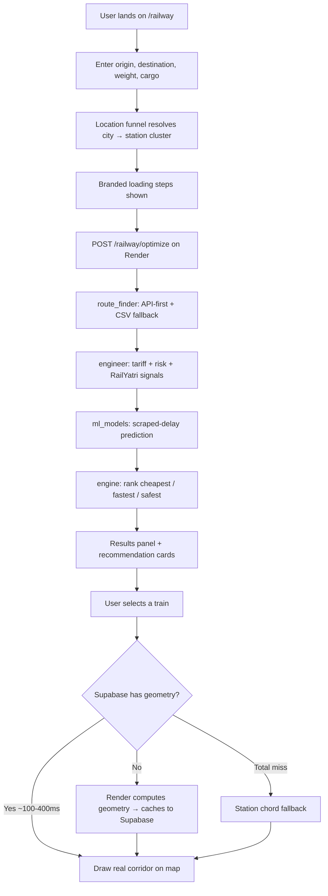

# LogiFlow Railway Pipeline — The Full Story

**Project:** LogiFlow Solution Challenge 2026  
**What this is:** A human-readable engineering log of how we built Indian Railways parcel routing — the failures, the data wars, and what actually shipped.  
**Frontend author:** **Ojas** (O · J · A · S) — `/railway` UI, map, API orchestration, Supabase-first reads  
**Timeline:** April → June 2026 (~10 weeks of active rail work)  
**Repo:** [LogiFlow-Solution-Challenge-2026](https://github.com/kvb1201/LogiFlow-Solution-Challenge-2026)

---

## Read this in 60 seconds

We set out to answer one question:

> *“I have 15 kg of cargo from Prayagraj to Surat. Which train should I put it on, what will it cost, how late will it probably be, and can you show me the actual route on a map — not a straight line?”*

**Today, that works.** Not perfectly everywhere — but honestly, defensibly, and in production.

| Question | Answer today | Confidence |
|----------|--------------|------------|
| Which trains run this corridor? | Live APIs + 2017 schedule fallback + hub-cluster search | High |
| What does parcel freight cost? | Official IRCA distance×weight slabs, 100/100 validated | **Very high** |
| How late will the train be? | ML on 15,650 scraped train-day records, not fake stars | High |
| Show me the route on a map | Real halt-by-halt polylines when cached; chord fallback otherwise | Medium–High |
| Will the page feel fast? | Supabase bypasses sleeping Render for map + ML panel | High on cached routes |

**The one-line verdict:** Indian Railways does not give you one API. We composed seven fragmented sources into a single `/railway` page. The hard part was never the UI — it was **finding truth in a system that was never designed to be queried**.

---

## Table of contents

1. [The illusion we started with](#1-the-illusion-we-started-with)
2. [The journey — six chapters](#2-the-journey--six-chapters)
3. [How the system works today](#3-how-the-system-works-today)
4. [Deep dive: pricing](#4-deep-dive-pricing)
5. [Deep dive: the map and geometry](#5-deep-dive-the-map-and-geometry)
6. [Deep dive: delay prediction](#6-deep-dive-delay-prediction)
7. [Deep dive: the frontend (Ojas)](#7-deep-dive-the-frontend-ojas)
8. [The war room — failures that taught us everything](#8-the-war-room--failures-that-taught-us-everything)
9. [What we tried and could not win](#9-what-we-tried-and-could-not-win)
10. [Honest scorecard](#10-honest-scorecard)
11. [For the next engineer](#11-for-the-next-engineer)

---

## 1. The illusion we started with

### What we thought building a rail product would look like

```
  User types "Mumbai → Delhi, 50 kg"
              │
              ▼
      ┌───────────────┐
      │  One clean    │
      │  Railways API │
      └───────┬───────┘
              │
    ┌─────────┼─────────┐
    ▼         ▼         ▼
  Trains    Price     Delays
              │
              ▼
         Draw on map ✓
```

Clean. Linear. Wrong.

### What Indian Railways data actually looks like

```
                    ┌─────────────────────────────────────┐
                    │         INDIAN RAILWAYS DATA        │
                    └─────────────────────────────────────┘
                                      │
        ┌─────────────┬───────────────┼───────────────┬─────────────┐
        ▼             ▼               ▼               ▼             ▼
   2017 CSV      PDF tariff      runningstatus    ConfirmTkt    RailYatri
   (stale but    tables (official  .in scrape      (live routes,  (past track
    complete)     but not API)     (no CSV export)  sometimes 403)  record)
        │             │               │               │             │
        └─────────────┴───────────────┴───────────────┴─────────────┘
                                      │
                              WE COMPOSE THESE
                                      │
                                      ▼
                         LogiFlow /railway page
```

**The core insight of this entire project:** There is no “Indian Railways API.” There is a **patchwork** — a 2017 timetable dump, PDF rate books from the Parcel Directorate, aggregator keys that work on some corridors and fail on others, and scraping polite enough to build a delay corpus without getting blocked. Our job was **composition**, not integration.

### The product promise (unchanged from day one)

| Step | What the user does | What the system must do |
|------|-------------------|------------------------|
| 1 | Lands on `/railway` | Cockpit-style page — not a generic form buried in a tab |
| 2 | Types cities, weight, cargo type | Resolve “Prayagraj”, “PRYJ”, “Allahabad” to the **same** station cluster |
| 3 | Hits search | Show **branded loading steps** — not a blank spinner for 90 seconds |
| 4 | Waits | Find trains even when the backend was asleep |
| 5 | Sees results | Cheapest / fastest / safest cards + full ranked list, **no duplicate trains** |
| 6 | Clicks a train | Map draws the **real corridor** through intermediate stations |
| 7 | Hovers stations | Readable labels on dense routes (Kashi Express has 80+ halts) |
| 8 | Glances at ML panel | Real model metrics — not “98% on-time” fiction |

---

## 2. The journey — six chapters

This is the story of how we got from “trains on a map” to “a decision engine you can trust.” No commit archaeology — just what happened, why it mattered, and what we learned.

---

### Chapter 1 — *“We can show trains on a map”*  
**Early April 2026**

**The situation.** LogiFlow was migrating from a Vite prototype to Next.js. Rail mode was the flagship demo: search two stations, see options, draw something on Leaflet.

**What we built.** The first end-to-end rail flow — input form, dark CARTO map tiles, a loading state, and a backend hook into schedule data. Within the first week, we also pulled official IRCA parcel tariff tables out of Railway Board PDFs and encoded them as JSON slab files (Scale L, S, P, R). That was the first moment we realized pricing is not a formula — it is **table archaeology**.

**What broke.** The map drew straight lines or nothing. Pricing existed on paper but the runtime still used rough multipliers. ML was a scaffold — structure without a real training corpus.

**What we learned.** Showing trains is easy. Showing **correct prices, real paths, and honest delays** is an entirely different product.

```
  APRIL WEEK 1                         APRIL WEEK 1 (reality check)
  ─────────────                        ────────────────────────────
  ✓ Map renders                        ✗ Corridor = chord line
  ✓ Search returns trains              ✗ Price = guess
  ✓ ML folder exists                   ✗ ML = no real labels
  ✓ Tariff JSON on disk                ✗ Tariff not wired to UI yet
```

**What shipped.** Proof of concept. Direction set. Tariff tables as ground truth for everything that followed.

---

### Chapter 2 — *“Rail deserves its own page”*  
**Mid April 2026**

**The situation.** Rail was sharing UI with road and generic forms. Multi-modal is the product vision, but rail’s complexity — station codes, hub cities, parcel scales — needed dedicated surface area.

**What we built.** `RailwayDashboard.tsx`: a full-page rail experience. Offline station caching so dev didn’t hard-depend on live APIs. Engine hardening so NaN values from flaky API responses didn’t crash the pipeline. Route limiting so a Mumbai hub query didn’t return 200 trains and freeze the browser.

**The hub-city problem (first encounter).** Mumbai is not one station. It is CSMT, LTT, BDTS, DR, KYN… Search “Mumbai → Delhi” and you are really searching a **cluster** of origins against a **cluster** of destinations. The backend started looping hub permutations. The frontend started showing the same train three times. We would fight this again in June.

**What broke.** Map still lacked true corridor polylines. Geometry was a concept, not a pipeline.

**What we learned.** Rail UX cannot be a tab. Station resolution is a **funnel**, not a string match.

**What shipped.** A dedicated `/railway` page that felt like a product, not a feature flag.

---

### Chapter 3 — *“Intelligence sells the ranking”*  
**Late April 2026**

**The situation.** Offline 2017 CSV gives routes, but misses new trains and live availability. Users need to feel the recommendation is *smart*, not just sorted by a single number.

**What we built.** API-first route discovery — live ConfirmTkt / aggregator calls preferred, CSV as fallback. RailYatri integration for past track record signals. LLM-generated explanations (“why this train”) via Gemini/Groq. Dynamic tariff calculation wired to the JSON slabs from Chapter 1. Hybrid mode cockpit so rail, road, air share design language.

**What broke.** Live APIs are corridor-dependent. Some return *“route not available”* — offline CSV saves those searches, but the user never knows which source answered. Still no historical delay corpus at scale. Geometry still thin.

**What we learned.** APIs give you **routes for today**. They do not give you **delay history for ranking**. That gap would define June.

**What shipped.** Intelligent-feeling recommendations with human-readable explanations. Rail stopped being a CSV browser.

---

### Chapter 4 — *“We had to build our own data”*  
**Early June 2026**

**The situation.** ~7 weeks of stable rail on main while, offline, we designed the uncomfortable truth: **if Indian Railways won’t publish delay CSVs, we scrape them.**

**What we built — the delay harvest.** A full pipeline: discover active trains from corridor walks, validate against the 2017 CSV, scrape runningstatus.in for per-station arrival/departure history, checkpoint everything for resumable multi-week runs. Makefile targets for pilot, resume, 3-day, live collection. Documented the entire Indian Railways data ecosystem honestly in `docs/INDIAN_RAILWAYS_DATA.md`.

**What we built — the geometry stack.** A schedule resolver that picks the best halt list per train (scraped delays → live scrape → cache → 2017 CSV). A geometry builder that walks those halts, geocodes each station, and produces map polylines. Station coordinate cache expanded to **9,524 entries**. New cockpit UI shell wrapping all pipeline modes.

**The scrape is slow, fragile, and grey.** We knew that going in. There is no alternative for ML ground truth. NTES has CAPTCHA. IRCTC blocks bots. CRIS wants enterprise licenses. runningstatus.in is the least-worst option.

**What broke.** Scraping runs for days. Not every train’s scrape includes every origin station (this would cause the Jaipur→Agra bug later). Geometry audit would later show 18% of trains still fail halt-order parity.

**What we learned.** **Data engineering is the product.** The UI is just the last mile.

```
  DATA WE HAD TO BUILD OURSELVES          DATA THAT EXISTS BUT WON'T LET YOU IN
  ─────────────────────────────          ───────────────────────────────────
  ✓ ir_train_delays.csv (15k+ rows)       ✗ NTES live bulk (CAPTCHA)
  ✓ active_trains.json (6,800+ trains)    ✗ IRCTC session scrape (403)
  ✓ discovered corridor fleet             ✗ FOIS calculator (403)
  ✓ per-train schedule halts              ✗ parcel web calculator (403)
  ✓ station coordinate cache (9.5k)       ✗ CRIS commercial feeds ($$$)
```

**What shipped.** A real ML training corpus. A real geometry pipeline. A product shell that looks like LogiFlow, not a hackathon demo.

---

### Chapter 5 — *“Free-tier hosting is the real enemy”*  
**Mid June 2026**

**The situation.** Everything worked on localhost. Production on Render (512 MB RAM, sleeps after 15 min idle) and Vercel was a different game.

**What we built.** Lazy CSV loading so the backend doesn’t OOM on boot. Scraped-delay ML trained with k-fold cross-validation (MAE ~22.7 min, ±30 min accuracy ~81%). Honest ML metrics panel — shows real CV numbers, not marketing. Simulation mode for demos without hitting APIs. Render keep-alive pings. Frontend backend warmup.

**What broke — the production bug parade.**

| What users saw | What was actually happening |
|----------------|----------------------------|
| Page “reloads” when switching trains | Frontend was re-warming the backend for 120 seconds on every click |
| Same train listed 3 times | Hub-cluster search deduped per station-pair, not per train number |
| Black invisible station labels | Dark map tiles + default Leaflet tooltip color |
| Kashi Express = unreadable label soup | 80+ permanent labels on one polyline |
| First search takes 90 seconds | Render cold start — instance was asleep |
| ML panel empty on Vercel | Panel waited on sleeping backend |
| Local dev “reload storm” | uvicorn `--reload` was watching `venv/`, restarting forever |

**What we learned.** On free-tier hosting, **caching is not optimization — it is survival.** Every user-facing latency problem traced back to “we woke Render for something that could have been cached.”

**What shipped.** Production-stable rail. Honest ML. Map that doesn’t assault your eyes on dense routes.

---

### Chapter 6 — *“Cache geography in Supabase; search in Render”*  
**Late June 2026**

**The situation.** We had geometry computation working. We had Supabase in ap-south-1. The insight: **map draws don’t need Python. Search does.**

**What we built.** Centralized location funnel — one place resolves “Agra”, “AGC”, “Allahabad”, “Prayagraj” into station clusters, backed by a PDF-parsed district index of ~7,400 stations. Supabase tables for `train_route_geometry`, `station_coordinates`, and `rail_ml_metrics`. Bulk sync script to pre-upload corridors for all India city pairs. Frontend cascade: **Supabase first (4s timeout) → Render compute → station chord fallback.** Tariff validation suite: 100 auto-generated all-India cases, all passing. Geometry cache invalidation for stale/wrong-endpoint rows.

**The architectural split (this is the key design decision):**

```
  ┌─────────────────────────────────────────────────────────────────┐
  │                        USER ON /railway                         │
  └─────────────────────────────────────────────────────────────────┘
                │                                    │
                │  SEARCH                            │  MAP (per train click)
                ▼                                    ▼
     ┌─────────────────────┐              ┌─────────────────────────┐
     │  Render FastAPI     │              │  Supabase (ap-south-1)  │
     │  POST /optimize     │              │  train_route_geometry   │
     │                     │              │  station_coordinates    │
     │  Needs Python:      │              │  rail_ml_metrics        │
     │  • route_finder     │              │                         │
     │  • tariff engine    │              │  ~100–400 ms reads      │
     │  • ML inference     │              │  Always on              │
     │  • hub clustering   │              │  No cold start          │
     │                     │              └───────────┬─────────────┘
     │  30–90s if asleep   │                          │ miss?
     └─────────────────────┘                          ▼
                                          ┌─────────────────────────┐
                                          │  Render GET /geometry     │
                                          │  (compute + cache write)  │
                                          └─────────────────────────┘
```

**What broke.** Bulk geometry sync started for ~8,010 city pairs but stopped around pair 115 (~580 rows uploaded). 18% of audited trains still fail geometry parity. “Agra” sometimes resolves to wrong PDF district codes instead of `AGC`. Search still always needs Render — we only bypassed it for map and ML panel.

**What we learned.** You can make a hosted rail product **feel fast** without making every operation serverless. Cache the **read-heavy, compute-once** artifacts. Accept that **search is compute-heavy** and optimize around it (warmup, loading UX), not through it.

**What shipped.** The current production shape. Supabase-first map. Validated pricing. Location funnel. The pipeline is architecturally done — remaining work is operational (finish bulk sync), not conceptual.

---

### Journey timeline (visual)

```
APRIL                          JUNE
│                              │
├─ Ch.1  First map + tariffs   │
├─ Ch.2  RailwayDashboard      │
├─ Ch.3  API-first + LLM       │     ├─ Ch.4  Scrape + geometry stack
│                              │     ├─ Ch.5  Production bug war
│         (stable on main)     │     └─ Ch.6  Supabase era
│                              │
▼                              ▼
"We can show trains"           "We can trust the answer"
```

---

## 3. How the system works today

### The user journey (end to end)



### Backend pipeline (what happens on search)

```
  CargoPayload { origin, destination, weight, cargo_type }
                        │
                        ▼
              ┌─────────────────┐
              │  RailPipeline   │
              └────────┬────────┘
                       │
         ┌─────────────┼─────────────┐
         ▼             ▼             ▼
   route_finder    engineer       ml_models
   (find trains)  (price +       (delay
                   features)       prediction)
         │             │             │
         └─────────────┼─────────────┘
                       ▼
                  ┌─────────┐
                  │ engine  │──► cheapest / fastest / safest + ranked all[]
                  └─────────┘
```

### Schedule resolution (how we know where a train stops)

For every train, we need an ordered list of halts. We don’t assume one source — we pick the best available:

| Priority | Source | When it wins |
|----------|--------|--------------|
| 1 | Scraped delay history | Train appears in our corpus with full halt chain |
| 2 | Live runningstatus scrape | On-demand HTML fetch when cache miss |
| 3 | Online schedule cache | Previously fetched aggregator response |
| 4 | 2017 CSV | Always available offline fallback |

Geometry builder then slices the halt list to the user’s exact origin→destination stations. **Exact station match beats fuzzy geocode slices** — this rule exists because of Jaipur→Agra, where a bad slice once started the corridor at the wrong junction.

### Caching layers (why the app doesn’t always feel slow)

```
  ┌────────────────────────────────────────────────────────────┐
  │  BROWSER (Ojas frontend)                                   │
  │  • session-scoped backend warm                             │
  │  • Supabase direct reads for geometry + ML metrics         │
  └────────────────────────────────────────────────────────────┘
  ┌────────────────────────────────────────────────────────────┐
  │  SUPABASE (always on, ap-south-1)                          │
  │  • train_route_geometry  (~580+ rows, growing)             │
  │  • station_coordinates   (~9,526 rows)                     │
  │  • rail_ml_metrics       (1 row, public read)              │
  └────────────────────────────────────────────────────────────┘
  ┌────────────────────────────────────────────────────────────┐
  │  REDIS (optional)                                          │
  │  • API response cache                                      │
  └────────────────────────────────────────────────────────────┘
  ┌────────────────────────────────────────────────────────────┐
  │  RENDER (sleeps, 512 MB)                                   │
  │  • Full pipeline compute                                   │
  │  • Geometry compute + Supabase write-back                  │
  └────────────────────────────────────────────────────────────┘
```

### By the numbers

| What | Scale |
|------|-------|
| Trains in 2017 schedule CSV | 11,113 |
| Stations in 2017 CSV | 8,150 |
| Station coordinates cached | 9,526 |
| Delay ML training examples | 15,650 train-days |
| Delay model CV MAE | 22.7 minutes |
| Delay ±30 min accuracy | ~81% |
| Supabase geometry rows | 580+ (bulk sync in progress) |
| Parcel pricing validation | **100 / 100** all-India cases |
| Geometry audit pass rate | **82 / 100** trains |

---

## 4. Deep dive: pricing

### Why this was harder than it looks

Early prototypes used formula tiers and empirical multipliers (including a 2.3× scale fudge). That produced plausible-looking numbers that were **wrong** — especially for bicycles (40 kg chargeable floor, ₹200 handling, Scale-L default) and long-haul multi-block weights.

Indian Railways parcel pricing is not `distance × rate`. It is **slab tables**: for each distance bracket and weight bracket, a specific rupee amount from an official PDF published by the Parcel Directorate.

### How pricing works now

```
  User input: 15 kg bicycle, Prayagraj → Surat (~1300 km)
                        │
                        ▼
              ┌─────────────────────┐
              │ Resolve chargeable    │
              │ weight: 15 → 40 kg   │  (IR two-wheeler rule)
              └──────────┬──────────┘
                         ▼
              ┌─────────────────────┐
              │ Pick scale: L       │  (bicycle default)
              │ (S/P/R for general/  │
              │  premier/rajdhani)  │
              └──────────┬──────────┘
                         ▼
              ┌─────────────────────┐
              │ Slab lookup in      │
              │ scale_l_official.json│
              │ for distance bracket│
              └──────────┬──────────┘
                         ▼
              ┌─────────────────────┐
              │ Post-processing:    │
              │ +2% dev surcharge   │
              │ +5% GST + ₹5 stat.  │
              │ round to ₹10        │
              │ + ₹200 handling     │
              └──────────┬──────────┘
                         ▼
                   ₹370 (validated)
```

### Official sources

| Scale | What it is | Source |
|-------|-----------|--------|
| **L** — Luggage | Brake-van / personal effects | Railway Board luggage rates PDF |
| **S** — Standard | General parcel | Standard rates PDF |
| **P** — Premier | Premium parcel | Premier rates PDF |
| **R** — Rajdhani | Rajdhani/Shatabdi class | Derived (~3× Scale-S; no dedicated PDF in repo — lower confidence) |

### How we proved it

We did not trust one code path. We built three:

1. **Spot checks** against PDF table cells (Scale L/S/P/R)
2. **Independent reference calculator** — separate implementation from the runtime engine
3. **100-case all-India auto-generated suite** — random cities, weights, cargo types, scales

Result: **100 out of 100 pass.** The 2.3× multiplier is gone. Bicycle rules match IR conventions.

> **Lesson:** The official parcel web calculator returns 403 to bots. The PDFs are the ground truth. We stopped fighting the calculator and started trusting the tables.

---

## 5. Deep dive: the map and geometry

### The problem with straight lines

A chord from Jaipur to Agra looks fine on a zoomed-out map. It is **a lie** — the train passes through Bandikui, Dausa, Bharatpur, and more. For a logistics decision tool, the corridor shape matters: shippers care about intermediate handling risk, delay propagation at junctions, and whether their cargo transits through known bottleneck stations.

### How a corridor is built

```
  Train 12965 on schedule resolver
              │
              ▼
  Full halt list: JP → DPA → BKI → BTE → AGC → ...
              │
              ▼
  Slice to user O-D: JP → ... → AGC  (exact station match)
              │
              ▼
  Geocode each halt:
    1. station_coordinates cache (9,526 entries)
    2. Nominatim / geocoder fallback
    3. RailRadar station API last resort
              │
              ▼
  Polyline: [JP, halt, halt, halt, ..., AGC]
              │
              ▼
  Cache to Supabase → frontend reads directly
```

### The Jaipur→Agra incident (instructive)

**Symptom:** User searches Jaipur → Agra. Map shows a line starting from GADJ (Gandhinagar Jaipur), not JP. No intermediate stations visible.

**Root cause (two compounding bugs):**
1. A stale Supabase cache row had wrong endpoints stored from an earlier fuzzy match
2. The delay-scrape schedule for that train didn’t include JP as an origin halt — geometry builder picked a wrong sub-slice

**Fix:** Geometry builder now prefers **exact origin→destination station match** on the schedule. Stale caches with wrong endpoints are rejected and recomputed. Regression test locked for JP→AGC.

This single bug taught us: **geometry is a data quality problem disguised as a rendering problem.**

### Map UX decisions (why the map doesn’t look like garbage)

| Problem | Why it happens | Solution |
|---------|---------------|----------|
| Black labels on dark map | CARTO dark tiles + default Leaflet tooltip styling | White `logiflow-map-label` CSS class |
| 80+ labels on Kashi Express | Every halt had a permanent tooltip | **Hover-only** intermediate hubs; endpoints always visible |
| Label pile-up when zoomed out | Dense central India corridors | Zoom-adaptive thinning — show every 3rd–10th intermediate based on zoom level |
| Map doesn’t resize after results load | Leaflet init race with dynamic layout | `mapReady` flag + `invalidateSize` after `fitBounds` |

### Geometry cascade (how the frontend gets a polyline)

```
  User clicks train 12965, JP → AGC
              │
              ▼
  ┌───────────────────────────┐
  │ 1. Supabase direct read   │  4 second timeout
  │    train_route_geometry   │  ~100–400 ms if hit
  └─────────────┬─────────────┘
                │ miss or untrusted?
                ▼
  ┌───────────────────────────┐
  │ 2. Render GET /geometry     │  retry once after 2s
  │    compute + write-back   │  5–30s if warm, 30–90s if cold
  └─────────────┬─────────────┘
                │ still miss?
                ▼
  ┌───────────────────────────┐
  │ 3. Station chord fallback │  Supabase station_coordinates
  │    JP ─────────────── AGC │  two-point line, labeled "direct"
  └───────────────────────────┘
```

**Trusted Supabase geometry** means: at least 2 points, not a `direct` or `corridor_reference` stub, and endpoints match the requested stations.

### Bulk sync status

We built a script to pre-upload geometry for all India: 90 cities × 89 directed pairs, up to 20 trains per pair (~8,010 pairs total). The run uploaded ~580 rows before interruption. First viewer on an uncached corridor still hits Render — but every subsequent viewer gets Supabase speed.

---

## 6. Deep dive: delay prediction

### Why we couldn’t use “on-time percentage”

Aggregator APIs give you today’s delay. They do not give you **historical delay distributions per train per corridor**. Indian Railways does not publish open delay CSVs. NTES is behind CAPTCHA. The alternative is scraping runningstatus.in over weeks to build a corpus.

### The ML pipeline

```
  runningstatus.in scrape
           │
           ▼
  ir_train_delays.csv  (15,650 train-day labels)
           │
           ▼
  Feature engineering:
    train type, junction count, hour of day,
    season, scraped running record, corridor signals
           │
           ▼
  GradientBoostingRegressor
  GroupKFold by train_number (no leakage)
           │
           ▼
  CV MAE: 22.7 minutes
  ±30 min accuracy: ~81%
           │
           ▼
  scraped_delay_model.pkl
  + metrics synced to Supabase rail_ml_metrics
```

### What the UI shows (honest metrics)

The ML panel does not say “98% on-time.” It shows:

- Cross-validated MAE in minutes
- ±30 minute hit rate
- Training row count
- Model type and validation strategy

The panel reads from **Supabase first**, then a static JSON fallback, then Render as last resort — same cascade pattern as geometry. A user on Vercel sees real metrics even when the backend is asleep.

### How delay affects ranking

The engine produces three recommendation lenses:

| Lens | Optimizes for | Delay role |
|------|--------------|------------|
| **Cheapest** | Minimum parcel cost | Tie-breaker |
| **Fastest** | Minimum travel time | ML adjusts expected arrival |
| **Safest** | Lowest delay risk | ML is primary signal |

---

## 7. Deep dive: the frontend (Ojas)

> **This section is my work.** The `/railway` user journey — from the first keystroke in the search form to the last intermediate station tooltip on a dense express — was designed and built by **Ojas**. The backend pipeline, scrapers, and Supabase sync are team engineering that I integrated against through the API client, warmup strategy, and direct Supabase reads.

### Page flow

```
  ┌─────────────────────────────────────────────────────────────┐
  │  PipelineModeLanding                                        │
  │  "How do you want to ship?"                                 │
  └──────────────────────────┬──────────────────────────────────┘
                             ▼
  ┌─────────────────────────────────────────────────────────────┐
  │  InputForm                                                  │
  │  source · destination · weight · cargo type · voice input   │
  └──────────────────────────┬──────────────────────────────────┘
                             ▼
  ┌─────────────────────────────────────────────────────────────┐
  │  RailwayLoading                                             │
  │  Step 1: Resolving stations...                              │
  │  Step 2: Searching routes...                                │
  │  Step 3: Computing prices...                                │
  │  Step 4: Ranking options...                                 │
  └──────────────────────────┬──────────────────────────────────┘
                             ▼
  ┌─────────────────────────────────────────────────────────────┐
  │  PipelineResultsChrome                                      │
  │  ┌──────────┐ ┌──────────┐ ┌──────────┐                    │
  │  │ Cheapest │ │ Fastest  │ │ Safest   │  + full ranked list│
  │  └──────────┘ └──────────┘ └──────────┘                    │
  └──────────────────────────┬──────────────────────────────────┘
                             ▼
  ┌──────────────────────┐  ┌─────────────────────────────────┐
  │  Map.tsx             │  │  RailMlQuantifiers.tsx            │
  │  corridor polyline   │  │  honest CV metrics              │
  │  hover-only hubs     │  │  Supabase-first read            │
  └──────────────────────┘  └─────────────────────────────────┘
```

### Key frontend components

| Component | What it does |
|-----------|------------|
| `RailwayDashboard.tsx` | Orchestrates search → results → map; geometry effect keyed by corridor only |
| `Map.tsx` | Leaflet polylines, hover-only intermediate hubs, zoom thinning, white labels |
| `InputForm.tsx` | Station autocomplete, weight/cargo inputs, voice-to-text brief |
| `RailwayLoading.tsx` | Branded step-based loader — critical for 30–90s cold starts |
| `RailMlQuantifiers.tsx` | ML metrics panel with Supabase-first fetch |
| `api.ts` | Optimize call, geometry cascade, Supabase client, ML metrics fetch |
| `dedupeRailOptions.ts` | Safety net — one row per train number in results list |
| `backendWarmup.ts` | Session-scoped warm; lightweight health ping, not 120s full warm per click |
| `cockpit/*` | PageShell, AmbientBackdrop, PipelineModeLanding — product chrome |

### The cold-start strategy (why the app doesn’t feel broken on Vercel)

Render sleeps. We cannot fix that on free tier. What we can do is **not wake it for read-only operations**:

| Operation | Wakes Render? | Strategy |
|-----------|--------------|----------|
| Search trains | Yes — must | Branded loading steps buy time; session warm reduces repeat pain |
| Draw map geometry | **No** (if cached) | Supabase direct read from browser |
| Show ML metrics | **No** | Supabase `rail_ml_metrics` direct read |
| Station autocomplete | Sometimes | Cached station list + lightweight health ping |

---

## 8. The war room — failures that taught us everything

Each entry: what users saw → what we found → what we fixed → what we learned.

---

### “The map is a straight line”

**Users saw:** Two dots connected by a chord. No intermediate stations.  
**We found:** Hub alias mismatch (CSMT vs LTT), or geometry builder falling back to `direct` because schedule halts were missing.  
**We fixed:** Hub equivalence codes in geometry builder; schedule resolver tier chain; stale cache rejection.  
**Lesson:** A chord is not a corridor. Always label fallbacks honestly.

---

### “Jaipur to Agra shows the wrong route”

**Users saw:** Line starting from GADJ, not Jaipur Junction. No stops.  
**We found:** Stale Supabase row + delay-scrape schedule missing JP as origin halt.  
**We fixed:** Exact O-D station match preference; cache invalidation for wrong endpoints; regression test.  
**Lesson:** Geometry bugs are data bugs. Fix the data chain, not the renderer.

---

### “The same train appears three times”

**Users saw:** Train 12301 listed three times in “All options” for Kolkata hub searches.  
**We found:** Hub-cluster search loops station permutations; dedup key was per-pair, not per train number.  
**We fixed:** Backend dedup by normalized train number; frontend `dedupeRailOptions.ts` as safety net.  
**Lesson:** Indian hub cities break naive dedup. Dedup on **train identity**, not station pair.

---

### “The page reloads when I click a train”

**Users saw:** Full loading state, Redis reconnect spam in console, 10+ second wait per train switch.  
**We found:** `ensureBackendWarm(120s)` fired on every geometry fetch; session wasn’t scoped.  
**We fixed:** Session-scoped warm in `backendWarmup.ts`; geometry effect keyed only by corridor identity.  
**Lesson:** Warm the backend **once per session**, not once per interaction.

---

### “React infinite loop on train select”

**Users saw:** Browser tab freezes; React max update depth exceeded.  
**We found:** `setRouteStops([])` created a new array reference every render, retriggering effects.  
**We fixed:** Functional setState; stable `NO_SEGMENTS` sentinel constant.  
**Lesson:** Empty array literals in React effects are landmines.

---

### “Local dev reloads forever”

**Users saw:** uvicorn restarting every few seconds; terminal spam.  
**We found:** `--reload` was watching the entire project including `venv/`.  
**We fixed:** `backend/run --reload-dir app` — only watch application code.  
**Lesson:** Dev ergonomics bugs waste days. Fix the tooling first.

---

### “Render OOM on deploy”

**Users saw:** 502 errors; instance killed.  
**We found:** 2017 CSV preload on startup exceeded 512 MB free-tier RAM.  
**We fixed:** Lazy singleton CSV load — index built on first request, not boot.  
**Lesson:** Free tier is a **hard constraint**, not a temporary inconvenience.

---

### “Parcel price is ₹800 for a bicycle”

**Users saw:** Absurd prices for light cargo.  
**We found:** Empirical 2.3× multiplier still in runtime path; bicycle not using 40 kg floor.  
**We fixed:** Official slab lookup only; bicycle chargeable weight + handling charge rules.  
**Lesson:** Plausible numbers that are wrong are worse than showing an error.

---

### “ML panel is empty on the hosted site”

**Users saw:** Blank metrics card on Vercel; works on localhost.  
**We found:** Panel waited on Render `/railway/model-info`; Render was asleep.  
**We fixed:** Sync metrics to Supabase; frontend reads `rail_ml_metrics` directly.  
**Lesson:** Same pattern as geometry — **cache read-heavy artifacts outside Render.**

---

### “Black station labels”

**Users saw:** Hover tooltips invisible on dark map.  
**We found:** CARTO dark basemap + default Leaflet tooltip color = black on dark.  
**We fixed:** `.logiflow-map-label` white tooltip CSS in `globals.css`.  
**Lesson:** Map UX is typography and contrast, not just polylines.

---

## 9. What we tried and could not win

Honest record of approaches that failed, were blocked, or remain partial.

### Government / official sources

| Target | What happened |
|--------|--------------|
| **NTES** bulk live enquiry | CAPTCHA + firewall — no automated access |
| **IRCTC** session scraping | Intermittent 403, bot detection |
| **parcel.indianrail.gov.in** web calculator | Returns 403 to bots — PDFs used instead |
| **FOIS** freight calculator | 403 — goods-oriented anyway |
| **CRIS** commercial data feeds | Enterprise license — not available |

### Data quality gaps that remain

| Gap | Impact | Status |
|-----|--------|--------|
| Bulk geometry sync incomplete | ~580 of ~8,010 city pairs cached | Run interrupted; resumable |
| 18% geometry audit failures | Some trains show wrong halt order | Known; not all fixed |
| Agra city → wrong station codes | PDF district codes beat `AGC` sometimes | Location funnel edge case |
| Scale-R (Rajdhani) tariff | No dedicated official PDF | Lower confidence than L/S/P |
| PDF parser for Scale S/P | Extracts 0 rows (layout differs) | JSON hand-verified; parser for regen only |
| 2017 CSV staleness | New trains missing | Mitigated by live API + scrape |

### Architectural constraints we accepted

| Constraint | Why we accepted it |
|-----------|-------------------|
| Search always hits Render | Supabase stores geometry, not route optimization results |
| Render cold start on first search | Free tier sleeps; warmup + loading UX mitigate, not eliminate |
| Scraping is slow | No alternative for historical delay ground truth |

---

## 10. Honest scorecard

```
  LOGIFLOW RAILWAY PIPELINE — JUNE 2026 SCORECARD
  ═══════════════════════════════════════════════

  SEARCH & DISCOVERY        █████████░  9/10   API-first + CSV fallback + hub clusters
  PARCEL PRICING            ██████████  10/10  100/100 validated, official slabs
  DELAY ML                  ████████░░  8/10   Real scraped corpus; ±30min ~81%
  MAP GEOMETRY              ███████░░░  7/10   Great when cached; 18% audit fail
  HOSTED UX (cold start)    ███████░░░  7/10   Supabase bypass helps map+ML; search still slow
  DATA COMPLETENESS         ██████░░░░  6/10   Bulk sync ~7% done; 2017 CSV stale
  LOCATION RESOLUTION       ████████░░  8/10   Funnel works; Agra edge case remains

  OVERALL VERDICT: Production-viable decision tool with honest pricing and ML.
                  Geographic coverage improving. Architecture is done.
```

### What a shipper gets today

| Scenario | Experience |
|----------|-----------|
| Prayagraj → Surat, bicycle, cached corridor | Fast map, ₹370 price, ranked options, real ML risk |
| Kolkata hub search | No duplicate trains, multi-station cluster handled |
| Kashi Express dense route | Hover-only labels, readable map |
| Uncached corridor, cold Render | 30–90s first search; branded loading; map may wait |
| Scale-R Rajdhani parcel | Price shown with lower confidence than L/S/P |

---

## 11. For the next engineer

### Run it locally

```bash
make dev
# Backend: http://localhost:8000
# Frontend: http://localhost:3000/railway
```

### Key environment variables

**Vercel (frontend):**
- `BACKEND_URL` — Render FastAPI
- `NEXT_PUBLIC_SUPABASE_URL` — geometry + ML direct reads
- `NEXT_PUBLIC_SUPABASE_ANON_KEY` — public read on cache tables

**Render (backend):**
- `SUPABASE_URL` / `SUPABASE_KEY` — geometry upsert, ML sync
- `REDIS_URL` — API response cache (optional)

### Useful commands

```bash
# Validate parcel pricing (100 cases)
cd backend && ./venv/bin/python scripts/validate_parcel_pricing.py -n 100

# Train delay ML + sync metrics to Supabase
make train-delay-ml
make sync-rail-ml-metrics

# Resume bulk geometry upload
cd backend && ./venv/bin/python scripts/sync_rail_supabase.py --full --verbose

# Geometry audit
make audit-rail-geometry TRAINS=100

# Tests
cd backend && pytest tests/test_rail_tariff.py tests/test_jaipur_agra_geometry.py
```

### What to do next (priority order)

1. **Finish `sync_rail_supabase.py --full`** — biggest user-visible improvement left; script is resumable
2. **Fix Agra → AGC resolution** in location funnel — causes 0-train pairs in bulk sync
3. **Investigate 18 failing geometry audit trains** — likely stale scrape or missing coords
4. **Scale-R tariff** — find or cite official Rajdhani parcel PDF

### Key files (if you are new to the codebase)

| Area | Start here |
|------|-----------|
| Rail page UI | `frontend/src/components/RailwayDashboard.tsx` |
| Map | `frontend/src/components/Map.tsx` |
| API + Supabase cascade | `frontend/src/services/api.ts` |
| Pipeline entry | `backend/app/pipelines/rail/pipeline.py` |
| Route discovery | `backend/app/pipelines/rail/route_finder.py` |
| Pricing | `backend/app/pipelines/rail/tariff.py` |
| Geometry | `backend/app/pipelines/rail/geometry_builder.py` |
| Location funnel | `backend/app/services/location_funnel.py` |
| Supabase sync | `backend/scripts/sync_rail_supabase.py` |
| Delay scrape | `backend/scripts/collect_ir_delay_history.py` |

---

## Closing note from Ojas

I did not build a rail product. I built a **composition layer** on top of a system that was never designed to be queried.

Indian Railways gives you a 2017 CSV, some PDF rate books, aggregator keys that work until they don’t, and a runningstatus.in page that yields delay history if you scrape it politely for weeks. None of that is a product. The product is the `/railway` page that makes it feel like one — where a shipper types two cities and gets a price they can defend, a delay estimate they can trust, and a map that shows where the train actually goes.

The frontend — search, loading, results, map, ML panel, cold-start strategy — is my work. The backend pipeline, scrapers, tariff engine, and Supabase sync are team engineering I integrated against so users don’t wait on a sleeping server just to see their corridor.

**The pipeline is architecturally done.** What remains is operational: upload more geometry, fix edge-case station resolution, close the 18% audit gap. The hard thinking is behind us. The data fill is in front of us.

---

*End of log.*
