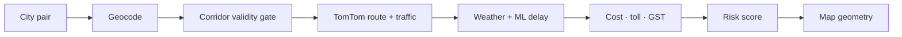
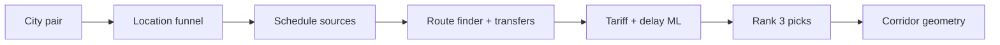
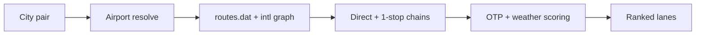
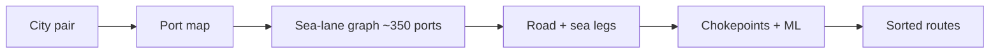
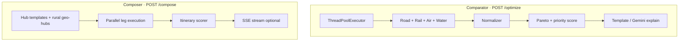

<div align="center">

# LogiFlow

### Multi-Modal Cargo Logistics Optimizer for India & Beyond

**Compare road · rail · air · water · and chained hybrid routes** — with ML delay prediction, live maps, AI intent parsing, saved trip plans, and route health monitoring.

<br/>

[](https://developers.google.com/solution-challenge)
[](https://logi-flow-solution-challenge-2026.vercel.app/)
[](https://logiflow-api-sbexkjk72q-el.a.run.app/health)
[]()

<br/>

[**Try the app**](https://logi-flow-solution-challenge-2026.vercel.app/) · [**API health**](https://logiflow-api-sbexkjk72q-el.a.run.app/health) · [**Docs**](./docs/) · [**Android APK**](https://drive.google.com/file/d/11l_qnlY7JiAerHGyBcq2wIVn0NtWNXNl/view?usp=sharing)

</div>

---

## The problem

India moves **4.6 billion tonnes** of freight every year — yet most shippers plan in **one mode at a time**. A corridor that is faster by rail, cheaper by water, or safer by road never gets compared side-by-side. The result: inflated cost, missed deadlines, and blind risk.

## The solution

LogiFlow runs **five independent transport pipelines** in parallel, normalizes every result into one schema, and ranks options with **priority-weighted scoring** and **Pareto dominance**. Shippers get cheapest / fastest / safest picks, a full comparator, chained hybrid itineraries, saved shipment plans with live route health, and plain-language AI explanations — backed by **real data**, not mock routes.

---

## At a glance

```mermaid
flowchart TB
    subgraph Client["Client"]
        WEB["Next.js 16 Web App"]
        APK["Android APK · Capacitor"]
        STT["Voice / text shipment brief"]
    end

    subgraph Edge["Vercel"]
        PROXY["/api/* proxy · compose · warm-backend"]
        AUTH["Google Sign-In → JWT"]
    end

    subgraph API["FastAPI · GCP Cloud Run"]
        R_INTENT["/intent/parse"]
        R_ROAD["/road/optimize"]
        R_RAIL["/railway/optimize"]
        R_AIR["/air/optimize"]
        R_WATER["/water/optimize"]
        R_COMP["/optimize · /comparator/routes"]
        R_COMPOSE["/compose · /compose/stream"]
        R_PLANNER["/planner/*"]
        R_AUTH["/auth/*"]
    end

    subgraph Pipelines["Pipelines"]
        P_ROAD["Road · TomTom + ML"]
        P_RAIL["Rail · CSV + scrape + tariff"]
        P_AIR["Air · OpenFlights + OTP"]
        P_WATER["Water · PortWatch + ML"]
        P_HYBRID["Hybrid · score + explain"]
        P_COMPOSE["Composer · chained legs"]
    end

    subgraph Data["Data & ML"]
        ML_R["Road delay ML"]
        ML_RL["Rail scrape ML"]
        ML_W["Water delay/ETA ML"]
        SUPA["Supabase · geometry + ML + air + compose cache"]
        REDIS["Redis · shared cache"]
        GEMINI["Gemini · intent + explain"]
    end

    WEB --> PROXY
    APK --> PROXY
    STT --> R_INTENT
    AUTH --> R_AUTH
    PROXY --> API

    R_ROAD --> P_ROAD
    R_RAIL --> P_RAIL
    R_AIR --> P_AIR
    R_WATER --> P_WATER
    R_COMP --> P_HYBRID
    R_COMPOSE --> P_COMPOSE
    R_PLANNER --> API

    P_ROAD --> ML_R
    P_RAIL --> ML_RL
    P_RAIL --> SUPA
    P_WATER --> ML_W
    P_ROAD --> REDIS
    P_AIR --> REDIS
    P_HYBRID --> GEMINI
```



---

## App surfaces

| Page | Route | Auth | What it does |
|------|-------|------|----------------|
| **Home** | `/` | Public | AI shipment brief · intent parsing · mode picker · quick launch |
| **Landing** | `/landing` | Public | Marketing welcome page with login CTA |
| **Login** | `/login` | Public | Google Sign-In → JWT session |
| **Dashboard** | `/dashboard` | Protected | Plan stats, active trips, mode shortcuts, AI brief |
| **My Plans** | `/reports` | Protected | Saved shipment reports with status filters |
| **Plan detail** | `/reports/[id]` | Protected | Trip lifecycle, route health, reoptimization |
| **Railway** | `/railway` | Public | Train search · parcel tariffs · corridor map · live delay ML |
| **Road** | `/road` | Public | TomTom routing · tolls · multi-stop · traffic simulation |
| **Air** | `/air` | Public | Domestic + international cargo lanes · OTP scoring |
| **Water** | `/water` | Public | Global port graph · chokepoints · maritime risk |
| **Hybrid** | `/hybrid` | Public | Chained multimodal legs (road→rail→air→water…) via compose |
| **Comparator** | `/comparator` | Public | All modes in one run · side-by-side scoring |
| **Waiting room** | `/waiting` | Public | Traffic queue when backend returns 429/503 · auto-resume |
| **Terms** | `/terms` | Public | Terms & Conditions |
| **Privacy** | `/privacy` | Public | Privacy Policy (Google OAuth, Supabase, analytics) |

---

## Pipelines at a glance

| Mode | Endpoint | Primary data | Output |
|------|----------|--------------|--------|
| Road | `POST /road/optimize` | TomTom · OpenWeather · ORS | Best route + alternatives + map polyline |
| Rail | `POST /railway/optimize` | CSV · delay scrape · RailRadar · tariff | Cheapest / fastest / safest + tariffs |
| Air | `POST /air/optimize` | OpenFlights · Supabase · OTP baselines | Ranked lanes or honest `no_routes` |
| Water | `POST /water/optimize` | PortWatch (~350 ports) · sea graph | Port chains + risk breakdown |
| Hybrid | `POST /optimize` · `POST /comparator/routes` | All four in parallel | Cross-mode winner + tradeoffs |
| Composer | `POST /compose` · `POST /compose/stream` | Hub templates + pipeline black-box | Chained hub itineraries |

---

## Pipeline deep dive

Each mode is a **first-class pipeline** with its own data sources, feature engineering, scoring, and UI page.

### Road



| | |
|---|---|
| **Routing** | TomTom real-road distance & duration — realtime or simulation |
| **Validity** | Trans-oceanic / undrivable corridors return `no_routes` (no fabricated metrics) |
| **ML** | Gradient boosting delay model (distance, time-of-day, weather, highway ratio) |
| **Controls** | Avoid tolls / highways · vehicle type · multi-stop · traffic-aware toggle |
| **Output** | `best` + `alternatives` with cost breakdown (freight · toll · GST · handling) |
| **Docs** | [Road pipeline](./docs/pipelines/road.md) |

---

### Rail



| | |
|---|---|
| **Schedules** | RailRadar · delay-scrape JSON · 2017 CSV (796k pairs, lazy-loaded) |
| **ML** | Gradient boosting on scraped delay corpus · metrics in Supabase `rail_ml_metrics` |
| **Tariffs** | Official Indian Railways parcel scales with GST & slab breakdown |
| **Output** | `cheapest` · `fastest` · `safest` — segments, running days, booking ease |
| **Map** | `GET /railway/trains/{n}/geometry` · Supabase `train_route_geometry` |
| **Docs** | [Rail pipeline](./docs/pipelines/rail.md) |

---

### Air



| | |
|---|---|
| **Dataset** | OpenFlights + Supabase `airports` / `air_routes` · international CSV fallbacks |
| **OTP** | Airport on-time performance congestion scoring (0–100) |
| **Filtering** | `MIN_CONFIDENCE = 60` — low-confidence lanes rejected |
| **Output** | `best_route` + `ranked_routes` **or** `{status: "no_routes"}` |
| **Docs** | [Air pipeline](./docs/pipelines/air.md) |

---

### Water



| | |
|---|---|
| **Ports** | ~350 global ports from PortWatch (`vessel_count > 500`) |
| **Graph** | Sparse `SEA_LANES` adjacency · chokepoint stress (Suez, Malacca, etc.) |
| **ML** | `water_delay_model.pkl` · `water_eta_model.pkl` |
| **Risk** | Weather · congestion · security · transshipment count |
| **Docs** | [Water pipeline](./docs/pipelines/water.md) |

---

### Hybrid & Composer



| | **Hybrid (Comparator)** | **Composer** |
|---|---|---|
| **Purpose** | Pick the best **single mode** for a corridor | Build **chained** legs across modes |
| **Execution** | Parallel · 30s timeout per mode | Hub templates · parallel legs with budget |
| **Scoring** | Normalize → dominance → weighted rank | Itinerary cost/time/risk aggregation |
| **UI** | `/comparator` side-by-side mode cards | `/hybrid` mode-chain visualizer |
| **Docs** | [Hybrid pipeline](./docs/pipelines/hybrid.md) | [Architecture](./docs/architecture.md) |

---

## Intelligence layer

| Layer | Modes served | Detail |
|-------|--------------|--------|
| **Intent parsing** | All | NL brief → cities · weight · priority · mode (`POST /intent/parse`) |
| **Road ML** | Road | GBM delay from TomTom distance + weather + time features |
| **Rail delay ML** | Rail | GBM on scraped delays · metrics in Supabase `rail_ml_metrics` |
| **Air OTP** | Air | Congestion scoring from baselines + weather + time-of-day |
| **Water ML** | Water | Delay/ETA models on PortWatch training data |
| **Hybrid scorer** | Comparator | Pareto dominance + priority weights across normalized modes |
| **Explainability** | All | Template (~0 ms) or **Gemini 2.5 Flash** (~2–5 s) |
| **Location funnel** | All | `station_name.pdf` + IATA → canonical cities & station clusters |
| **Planner** | Saved trips | Route health · reoptimization · notifications |
| **Caching** | All | RequestContext · Redis · Supabase (geometry, ML, compose legs) |

---

## Authentication & planner

- **Google OAuth 2.0** via Google Identity Services → backend `POST /auth/login` → JWT (7-day)
- Protected routes: `/dashboard`, `/reports`, `/reports/[id]`
- **Shipment planner API** (`/planner/*`): save reports, execute/stop/cancel trips, route health, reoptimization v1, notifications
- Database: SQLite locally · Postgres in production via `DATABASE_URL`

---

## Reliability

- Frontend **warms Cloud Run on load** (`/api/warm-backend`), re-pings on tab focus, and every **3 min** while open
- **Traffic queue** (`/waiting`): holds users on 429/503 with auto-resume
- **Rate limiting**: slowapi per-IP (optimize 8/min, compose 8/min, auth 20/min)
- **Optimize guard**: response cache + concurrency semaphore (503 when saturated)
- GitHub Actions deploys backend to Cloud Run on `main` pushes

---

## Tech stack

| Layer | Stack |
|-------|-------|
| Frontend | **Next.js 16** · React 19 · TypeScript · Tailwind 4 · Zustand · Leaflet / Mapbox |
| Backend | **FastAPI** · Python 3.11+ · Uvicorn · SQLAlchemy async |
| ML | scikit-learn · custom feature engineering · scraped delay retrain pipeline |
| AI | Google **Gemini 2.5 Flash** · Groq fallback (intent, rail explain, Whisper STT) |
| Maps & routing | TomTom · OpenRouteService · Google Geocoding · RailRadar live API |
| Storage | Supabase (geometry, ML, air, compose cache) · Redis · SQLite/Postgres planner DB |
| Deploy | **Vercel** (frontend) · **GCP Cloud Run** (backend, asia-south1) · GitHub Actions |
| Mobile | Capacitor → Android APK |

---

## Repository layout

```
LogiFlow-Solution-Challenge-2026/
├── backend/
│   ├── app/
│   │   ├── main.py              # FastAPI entry
│   │   ├── pipelines/           # road · rail · air · water · hybrid
│   │   ├── routes/              # REST handlers (13 routers)
│   │   ├── services/            # compose · intent · weather · auth · ML stores
│   │   ├── models/              # SQLAlchemy domain + Pydantic schemas
│   │   └── middleware/          # rate limits · optimize guard
│   ├── data/                    # airports · routes · PortWatch · delay scrape
│   ├── scripts/                 # ML training · Supabase sync · scrapers
│   └── tests/                   # pytest suite
├── frontend/
│   └── src/
│       ├── app/                 # 15 pages + API route handlers
│       ├── components/          # cockpit · forms · maps · planner · auth
│       ├── services/            # api.ts · plannerApi.ts
│       └── store/               # Zustand (auth · pipeline · planner)
├── docs/                        # architecture · API · deployment · pipelines
├── supabase/migrations/         # airports · air_routes · otp · rail_ml · compose cache
├── scripts/                     # deploy-gcp-cloud-run.sh · prod audit
└── README.md
```

---

## Quick start

### Backend

```bash
cd backend
python -m venv venv && source venv/bin/activate   # Windows: venv\Scripts\activate
pip install -r requirements.txt
cp .env.example .env   # add API keys (see file for list)
uvicorn app.main:app --reload --port 8000
```

### Frontend

```bash
cd frontend
npm install
echo "NEXT_PUBLIC_API_URL=http://localhost:8000" > .env.local
npm run dev
# → http://localhost:3000
```

### Production env (Vercel)

| Variable | Purpose |
|----------|---------|
| `BACKEND_URL` | Cloud Run API for `/api/*` rewrites + warmup |
| `NEXT_PUBLIC_API_URL` | Same URL for SSR fallback |
| `NEXT_PUBLIC_COMPOSE_URL` | Direct compose URL (long-running hybrid runs) |
| `GOOGLE_CLIENT_ID` / `NEXT_PUBLIC_GOOGLE_CLIENT_ID` | Google Sign-In |
| `NEXT_PUBLIC_SUPABASE_URL` | Supabase project URL |
| `NEXT_PUBLIC_SUPABASE_ANON_KEY` | Supabase anon key (geometry + ML metrics) |
| `NEXT_PUBLIC_RAILRADAR_API_KEY` | Live train map (optional) |

See [deployment guide](./docs/deployment.md) for Cloud Run, Vercel, Supabase sync, and Android APK.

---

## API map

| Endpoint | Description |
|----------|-------------|
| `GET /health` | Liveness probe |
| `POST /auth/login` | Google credential → JWT |
| `GET /auth/me` | Current user (Bearer JWT) |
| `POST /intent/parse` | NL shipment brief → structured intent |
| `POST /road/optimize` | Road routing + ML delay |
| `POST /railway/optimize` | Rail routes + tariffs + delay ML |
| `POST /railway/simulate` | Rail what-if simulation |
| `GET /railway/trains/{n}/geometry` | Map corridor polyline + stops |
| `GET /railway/model-info` | Rail delay ML metrics |
| `GET /locations/resolve` | Location funnel debug |
| `POST /air/optimize` | Air cargo lanes |
| `POST /water/optimize` | Port-to-port routes |
| `POST /optimize` · `POST /comparator/routes` | All modes, one request |
| `POST /compose` · `POST /compose/stream` | Chained multimodal itineraries |
| `POST /planner/reports` | Save shipment report (auth) |
| `GET /planner/reports/{id}/route-health` | Live trip monitoring (auth) |

Full schemas → [`docs/api_contract.md`](./docs/api_contract.md)

---

## Documentation

| Doc | Contents |
|-----|----------|
| [Architecture](./docs/architecture.md) | System design & data flow |
| [System design](./docs/system-design.md) | Scalability & principles |
| [API contract](./docs/api_contract.md) | Request / response shapes |
| [Deployment](./docs/deployment.md) | Vercel · Cloud Run · APK |
| [GCP deployment](./docs/gcp-deployment.md) | Cloud Run setup & team-3mo profile |
| [Road pipeline](./docs/pipelines/road.md) | TomTom + ML + corridor validation |
| [Rail pipeline](./docs/pipelines/rail.md) | Scraping + tariffs + geometry |
| [Air pipeline](./docs/pipelines/air.md) | OpenFlights + OTP |
| [Water pipeline](./docs/pipelines/water.md) | PortWatch + global ports |
| [Hybrid pipeline](./docs/pipelines/hybrid.md) | Scoring + compose engine |
| [Indian Railways data](./docs/INDIAN_RAILWAYS_DATA.md) | Data sourcing strategy |
| [Air OTP scoring](./docs/air-otp-congestion-scoring.md) | Congestion index details |
| [International air](./docs/international-air-routing-summary.md) | Global route graph |

---

## Demo links

| Platform | URL |
|----------|-----|
| **Web app** | https://logi-flow-solution-challenge-2026.vercel.app/ |
| **API health** | https://logiflow-api-sbexkjk72q-el.a.run.app/health |
| **Android APK** | [Google Drive](https://drive.google.com/file/d/11l_qnlY7JiAerHGyBcq2wIVn0NtWNXNl/view?usp=sharing) |

---

## Team

Built by **Neural Foundry** for the **Google Solution Challenge 2026**.

| Member | Focus |
|--------|-------|
| Kavya Bhatiya | Founder · road pipeline · hybrid scoring · auth/planner · deployment |
| Ojas Srivastava | Technical lead · Next.js migration · rail · compose · Supabase · GCP |
| Shreya | Water/maritime pipeline · PortWatch · cockpit UI redesign |
| Samanvitha Bolisetty | Air cargo pipeline · OTP scoring · international routing |

---

## License

Competition submission — **team members only**.

External reuse, copying, or redistribution is **not permitted**.

All rights reserved © 2026 **Kavya Bhatiya**
