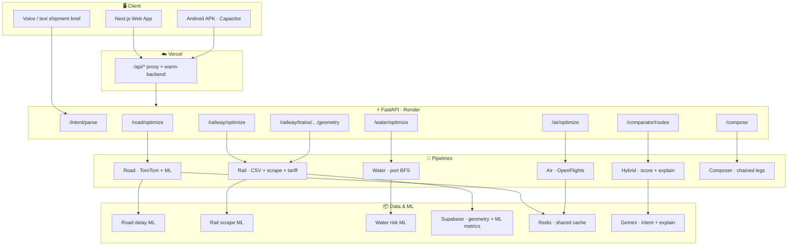
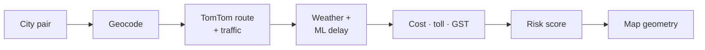
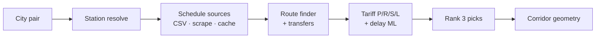
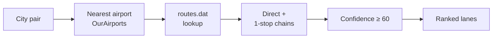
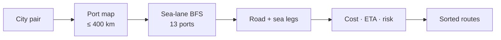
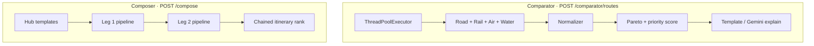
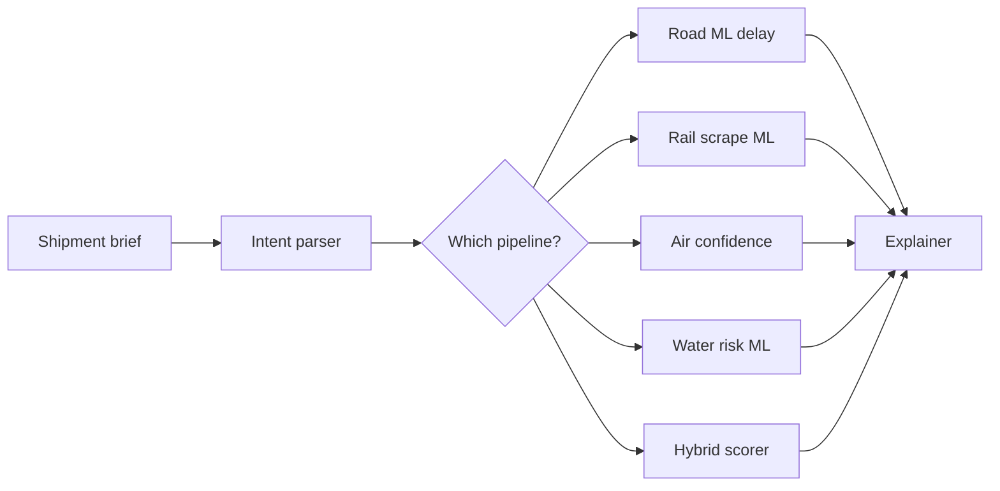

<div align="center">

# LogiFlow

### Multi-Modal Cargo Logistics Optimizer for India

**Compare road · rail · air · water · and chained hybrid routes** — with ML delay prediction, live maps, and AI explanations.

<br/>

[](https://developers.google.com/solution-challenge)
[](https://logi-flow-solution-challenge-2026.vercel.app/)
[](https://logiflow-solution-challenge-2026.onrender.com/health)
[]()

<br/>

[**Try the app**](https://logi-flow-solution-challenge-2026.vercel.app/) · [**API health**](https://logiflow-solution-challenge-2026.onrender.com/health) · [**Docs**](./docs/) · [**Android APK**](https://drive.google.com/file/d/11l_qnlY7JiAerHGyBcq2wIVn0NtWNXNl/view?usp=sharing)

</div>

---

## The problem

India moves **4.6 billion tonnes** of freight every year — yet most shippers plan in **one mode at a time**. A corridor that is faster by rail, cheaper by water, or safer by road never gets compared side-by-side. The result: inflated cost, missed deadlines, and blind risk.

## The solution

LogiFlow runs **five independent transport pipelines** in parallel, normalizes every result into one schema, and ranks options with **priority-weighted scoring** and **Pareto dominance**. Shippers get cheapest / fastest / safest picks, a full comparator, chained hybrid itineraries, and plain-language AI explanations — backed by **real data**, not mock routes.

---

## At a glance



---

## App surfaces

| Page | Route | What it does |
|------|-------|----------------|
| 🏠 **Home** | `/` | AI shipment brief · intent parsing · quick launch |
| 🚂 **Railway** | `/railway` | Train search · parcel tariffs · **corridor map** · live delay |
| 🚛 **Road** | `/road` | TomTom routing · tolls · traffic-aware simulation |
| ✈️ **Air** | `/air` | Airport resolution · direct & one-stop cargo lanes |
| 🚢 **Water** | `/water` | Port-to-port BFS · risk breakdown |
| 🔀 **Hybrid** | `/hybrid` | **Chained multimodal** legs (rail→road→water…) |
| ⚖️ **Comparator** | `/comparator` | All modes in one run · side-by-side scoring |

---

## Pipelines at a glance

| Mode | Endpoint | Primary data | Output |
|------|----------|--------------|--------|
| 🚛 Road | `POST /road/optimize` | TomTom · OpenWeather · ORS | Best route + alternatives + map polyline |
| 🚂 Rail | `POST /railway/optimize` | CSV · delay scrape · live scrape | Cheapest / fastest / safest + tariffs |
| ✈️ Air | `POST /air/optimize` | OpenFlights · OurAirports | Ranked lanes or honest `no_routes` |
| 🚢 Water | `POST /water/optimize` | 13-port sea-lane graph | Port chains + risk breakdown |
| ⚡ Hybrid | `POST /comparator/routes` | All four in parallel | Cross-mode winner + tradeoffs |
| 🔗 Composer | `POST /compose` | Pipeline black-box calls | Chained hub itineraries |

---

## Pipeline deep dive

Each mode is a **first-class pipeline** with its own data sources, feature engineering, scoring, and UI page — not a rail add-on.

### 🚛 Road



| | |
|---|---|
| **Routing** | TomTom real-road distance & duration — realtime or simulation |
| **ML** | Gradient boosting delay model (distance, time-of-day, weather, highway ratio) |
| **Controls** | Avoid tolls / highways · vehicle type · traffic-aware toggle |
| **Output** | `best` + `alternatives` with cost breakdown (freight · toll · GST · handling) |
| **Map** | Full TomTom polyline drawn on Leaflet |
| **Docs** | [Road pipeline](./docs/pipelines/road.md) |

---

### 🚂 Rail



| | |
|---|---|
| **Schedules** | Delay-scrape JSON · ConfirmTkt scrape · 2017 CSV (796k pairs, lazy-loaded) |
| **ML** | Gradient boosting on **15,650** scraped train-day rows · 59% ±15m / 81% ±30m CV |
| **Tariffs** | Official Indian Railways parcel scales with GST & slab breakdown |
| **Output** | `cheapest` · `fastest` · `safest` — each with segments, running days, booking ease |
| **Map** | Per-train corridor via `GET /railway/trains/{n}/geometry` · Supabase `train_route_geometry` |
| **Audit** | 100-train schedule-vs-map check (`make audit-rail-geometry`) — 82/100 pass today |
| **Docs** | [Rail pipeline](./docs/pipelines/rail.md) |

---

### ✈️ Air



| | |
|---|---|
| **Dataset** | OpenFlights `routes.dat` + `airports.csv` — no fabricated routes |
| **Resolution** | Multi-airport cities (DEL, BOM, BLR…) · Haversine nearest fallback |
| **Filtering** | `MIN_CONFIDENCE = 60` — low-confidence lanes rejected |
| **Output** | `best_route` + `ranked_routes` **or** `{status: "no_routes"}` |
| **UI** | Dedicated `/air` page with lane cards and feasibility messaging |
| **Docs** | [Air pipeline](./docs/pipelines/air.md) |

---

### 🚢 Water



| | |
|---|---|
| **Ports** | 13 major Indian ports (7 west · 6 east) — inland cities get honest `no_routes` |
| **Graph** | Sparse `SEA_LANES` adjacency — no teleportation between coasts |
| **Engineering** | Truck legs city↔port · vessel legs port↔port · transshipment fees |
| **Risk** | Weather · congestion · security · transshipment count |
| **ML** | ETA adjustment hooks · port congestion prediction |
| **Output** | Ranked multi-segment routes with per-leg mode tags |
| **Docs** | [Water pipeline](./docs/pipelines/water.md) |

---

### ⚡ Hybrid & 🔗 Composer



| | **Hybrid (Comparator)** | **Composer** |
|---|---|---|
| **Purpose** | Pick the best **single mode** for a corridor | Build **chained** legs across modes |
| **Execution** | Parallel · 30s timeout per mode · skips unavailable | Sequential black-box calls via hub templates |
| **Scoring** | Relative normalize → dominance check → weighted rank | Itinerary cost/time/risk aggregation |
| **Explain** | Tradeoff bullets · optional Gemini `detailed` mode | Per-leg summaries in hybrid UI |
| **UI** | `/comparator` side-by-side mode cards | `/hybrid` mode-chain visualizer |
| **Docs** | [Hybrid pipeline](./docs/pipelines/hybrid.md) | [Architecture](./docs/architecture.md) |

---

## Intelligence layer (all modes)



| Layer | Modes served | Detail |
|-------|--------------|--------|
| **Intent parsing** | All | NL brief → cities · weight · priority · mode (`/intent/parse`) |
| **Road ML** | Road | GBM delay from TomTom distance + weather + time features |
| **Rail delay ML** | Rail | GBM on scraped `ir_train_delays.csv` · metrics in Supabase `rail_ml_metrics` |
| **Air confidence** | Air | Route reliability score — sub-60 lanes dropped |
| **Water risk ML** | Water | ETA & congestion hooks on port-graph paths |
| **Hybrid scorer** | Comparator | Pareto dominance + priority weights across normalized modes |
| **Explainability** | Hybrid · per-mode | Template (~0 ms) or **Gemini 2.5 Flash** (~2–5 s) |
| **Location funnel** | All | `station_name.pdf` + IATA → canonical cities & station clusters |
| **Caching** | All | `RequestContext` · Redis · Supabase (rail geometry + ML metrics) |

---

## Reliability

Frontend **warms Render on load** (`/api/warm-backend`), re-pings on tab focus, and every **3 min** while open. GitHub Actions pings every **5 min** when the `BACKEND_URL` secret is set.

---

## Tech stack

<table>
<tr><th>Layer</th><th>Stack</th></tr>
<tr><td>Frontend</td><td><strong>Next.js 16</strong> · React 19 · TypeScript · Tailwind 4 · Zustand · Leaflet / Mapbox</td></tr>
<tr><td>Backend</td><td><strong>FastAPI</strong> · Python 3.11+ · Uvicorn</td></tr>
<tr><td>ML</td><td>scikit-learn · custom feature engineering · scraped delay retrain pipeline</td></tr>
<tr><td>AI</td><td>Google <strong>Gemini 2.5 Flash</strong> · Groq fallback</td></tr>
<tr><td>Maps & routing</td><td>TomTom · OpenRouteService · Google Geocoding · RailRadar live API</td></tr>
<tr><td>Storage</td><td>Supabase (rail geometry, ML metrics, air data) · Redis (cache) · static JSON fallbacks</td></tr>
<tr><td>Deploy</td><td><strong>Vercel</strong> (frontend) · <strong>Render</strong> (backend) · GitHub Actions keep-alive</td></tr>
<tr><td>Mobile</td><td>Capacitor → Android APK</td></tr>
</table>

---

## Repository layout

```
LogiFlow-Solution-Challenge-2026/
├── backend/
│   ├── app/
│   │   ├── main.py              # FastAPI entry
│   │   ├── pipelines/
│   │   │   ├── road/            # TomTom engine + ML
│   │   │   ├── rail/            # CSV · scrape · tariff · geometry · delay ML
│   │   │   ├── air/             # OpenFlights pipeline
│   │   │   ├── water/           # Port BFS + risk
│   │   │   └── hybrid/          # Normalizer · scorer · explainer
│   │   ├── routes/              # REST handlers (rail, road, air, water, compose…)
│   │   └── services/            # Gemini · intent · weather · geocoder · Supabase
│   └── data/                    # airports.csv · routes.dat · delay scrape corpus
├── frontend/
│   └── src/
│       ├── app/                 # railway · road · air · water · hybrid · comparator
│       ├── components/          # maps · forms · AI brief · dashboards
│       ├── services/api.ts      # typed API client
│       └── store/               # Zustand global state
├── docs/                        # architecture · API · deployment · per-pipeline guides
├── .github/workflows/           # Render keep-alive (every 5 min)
└── README.md
```

---

## Quick start

### Backend

```bash
cd backend
python -m venv venv && source venv/bin/activate   # Windows: venv\Scripts\activate
pip install -r requirements.txt
cp .env.example .env   # add API keys (see file for list)
uvicorn app.main:app --reload --port 8000
```

### Frontend

```bash
cd frontend
npm install
echo "NEXT_PUBLIC_API_URL=http://localhost:8000" > .env.local
npm run dev
# → http://localhost:3000
```

### Production env (Vercel)

| Variable | Purpose |
|----------|---------|
| `BACKEND_URL` | Render API for `/api/*` rewrites + warmup |
| `NEXT_PUBLIC_SUPABASE_URL` | Supabase project URL (rail ML metrics on `/railway`) |
| `NEXT_PUBLIC_SUPABASE_ANON_KEY` | Supabase anon key (read `rail_ml_metrics`) |
| `NEXT_PUBLIC_RAILRADAR_API_KEY` | Live train map (optional) |

See [deployment guide](./docs/deployment.md) for Render, Vercel, Supabase sync, and Android APK.

---

## API map

| Endpoint | Description |
|----------|-------------|
| `GET /health` | Liveness probe |
| `POST /intent/parse` | NL shipment brief → structured intent |
| `POST /road/optimize` | Road routing + ML delay |
| `POST /railway/optimize` | Rail routes + tariffs + delay ML |
| `GET /railway/trains/{n}/geometry` | Map corridor polyline + stops |
| `GET /railway/model-info` | Rail delay ML metrics (also cached in Supabase) |
| `GET /locations/resolve` | Location funnel debug (station code → city cluster) |
| `POST /air/optimize` | Air cargo lanes |
| `POST /water/optimize` | Port-to-port routes |
| `POST /comparator/routes` | All modes, one request |
| `POST /compose` | Chained multimodal itineraries |

Full schemas → [`docs/api-contract.md`](./docs/api-contract.md)

---

## Documentation

| Doc | Contents |
|-----|----------|
| [Architecture](./docs/architecture.md) | System design & data flow |
| [System design](./docs/system-design.md) | Scalability & principles |
| [API contract](./docs/api-contract.md) | Request / response shapes |
| [Deployment](./docs/deployment.md) | Vercel · Render · APK · keep-alive |
| [Road pipeline](./docs/pipelines/road.md) | TomTom + ML |
| [Rail pipeline](./docs/pipelines/rail.md) | Scraping + tariffs + geometry |
| [Air pipeline](./docs/pipelines/air.md) | OpenFlights |
| [Water pipeline](./docs/pipelines/water.md) | Port routing |
| [Hybrid pipeline](./docs/pipelines/hybrid.md) | Scoring engine |

---

## Demo links

| Platform | URL |
|----------|-----|
| 🌐 **Web app** | https://logi-flow-solution-challenge-2026.vercel.app/ |
| ⚡ **API health** | https://logiflow-solution-challenge-2026.onrender.com/health |
| 📱 **Android APK** | [Google Drive](https://drive.google.com/file/d/11l_qnlY7JiAerHGyBcq2wIVn0NtWNXNl/view?usp=sharing) |

---

## Team

Built by **Neural Foundry** for the **Google Solution Challenge 2026**.

---

## License

Competition submission — **team members only**.

External reuse, copying, or redistribution is **not permitted**.

All rights reserved © 2026 **Kavya Bhatiya**
