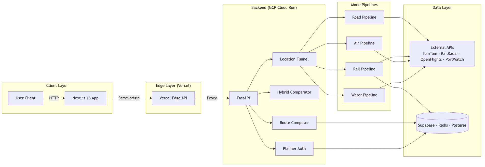
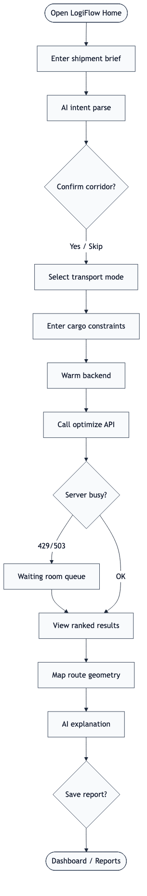
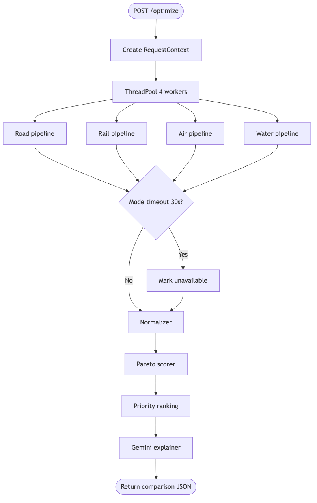

<div align="center">

<p align="center">
  <svg width="100%" height="180" viewBox="0 0 1200 180" xmlns="http://www.w3.org/2000/svg">
    <defs>
      <linearGradient id="headerGrad" x1="0%" y1="0%" x2="100%" y2="0%">
        <stop offset="0%" style="stop-color:#4285F4;stop-opacity:1" />
        <stop offset="50%" style="stop-color:#34A853;stop-opacity:1" />
        <stop offset="100%" style="stop-color:#FBBC05;stop-opacity:1" />
      </linearGradient>
    </defs>
    <rect width="1200" height="180" fill="#08090C" rx="12"/>
    <text x="600" y="80" font-family="Arial, sans-serif" font-size="64" font-weight="bold" fill="url(#headerGrad)" text-anchor="middle">LogiFlow</text>
    <text x="600" y="130" font-family="Arial, sans-serif" font-size="20" fill="#D4D4D8" text-anchor="middle">Decision Intelligence for Multi-Modal Logistics</text>
    <circle cx="200" cy="90" r="40" fill="#4285F4" opacity="0.3"/>
    <circle cx="1000" cy="90" r="40" fill="#34A853" opacity="0.3"/>
    <circle cx="400" cy="50" r="25" fill="#FBBC05" opacity="0.3"/>
    <circle cx="800" cy="50" r="25" fill="#EA4335" opacity="0.3"/>
  </svg>
</p>

### Compare every way to move cargo — road, rail, air, water, and chained hybrid routes — in one honest run.

[](https://developers.google.com/solution-challenge)
[](https://logi-flow-solution-challenge-2026.vercel.app/)
[](https://logiflow-api-sbexkjk72q-el.a.run.app/health)

<br/>

[**Try the app**](https://logi-flow-solution-challenge-2026.vercel.app/) · [**API health**](https://logiflow-api-sbexkjk72q-el.a.run.app/health) · [**Documentation**](./docs/) · [**Android APK**](https://drive.google.com/file/d/17uYe7_o_Sqc373dVvzrk8FUo48cbZ-ME/view?usp=drive_link)

</div>

---

<p align="center">
  <svg width="100%" height="60" viewBox="0 0 1200 60" xmlns="http://www.w3.org/2000/svg">
    <rect width="1200" height="60" fill="#08090C" rx="8"/>
    <text x="600" y="40" font-family="Arial, sans-serif" font-size="28" font-weight="bold" fill="#34D399" text-anchor="middle">The Problem</text>
    <line x1="400" y1="50" x2="800" y2="50" stroke="#34D399" stroke-width="2" opacity="0.5"/>
  </svg>
</p>

## The problem

India moves **4.6 billion tonnes** of freight every year, yet most shippers still plan in **one mode at a time**. A corridor that is faster by rail, cheaper by water, or safer by road rarely gets compared side-by-side. The result is higher cost, missed deadlines, and blind risk — especially for MSMEs who cannot afford a full logistics desk.

<p align="center">
  <svg width="100%" height="60" viewBox="0 0 1200 60" xmlns="http://www.w3.org/2000/svg">
    <rect width="1200" height="60" fill="#08090C" rx="8"/>
    <text x="600" y="40" font-family="Arial, sans-serif" font-size="28" font-weight="bold" fill="#34D399" text-anchor="middle">The Solution</text>
    <line x1="400" y1="50" x2="800" y2="50" stroke="#34D399" stroke-width="2" opacity="0.5"/>
  </svg>
</p>

## The solution

**LogiFlow** runs five transport pipelines in parallel, normalizes every result into one schema, and ranks options with **priority-weighted scoring** and **Pareto dominance**. Shippers get cheapest / fastest / safest picks, a full multimodal comparator, chained hybrid itineraries, saved shipment plans with route health monitoring, and plain-language AI explanations — backed by **real data**, not fabricated routes.

### Key capabilities

- Multi-modal route optimization (Road, Rail, Air, Water)
- Hybrid route composition across transport modes
- Priority-aware optimization (Cost / Time / Safety)
- Pareto-based route ranking
- ML-powered delay prediction
- Real-time traffic and weather intelligence
- AI-generated route explanations
- Shipment planning and lifecycle monitoring
- Web + Android support

### Why LogiFlow?

| Traditional Planning | LogiFlow |
|----------------------|----------|
| Single transport mode | Multi-modal comparison |
| Manual evaluation | Automated optimization |
| Static routes | Real-time intelligence |
| No explanations | AI-generated reasoning |
| Separate planning tools | Unified decision platform |

---

<p align="center">
  <svg width="100%" height="60" viewBox="0 0 1200 60" xmlns="http://www.w3.org/2000/svg">
    <rect width="1200" height="60" fill="#08090C" rx="8"/>
    <text x="600" y="40" font-family="Arial, sans-serif" font-size="28" font-weight="bold" fill="#34D399" text-anchor="middle">Product Snapshot</text>
    <line x1="400" y1="50" x2="800" y2="50" stroke="#34D399" stroke-width="2" opacity="0.5"/>
  </svg>
</p>

## Product snapshot

<p align="center">
  
  <br/>
  <sub>Multi-modal logistics planning, optimization, monitoring and decision intelligence.</sub>
</p>

<p align="center">
  <svg width="100%" height="60" viewBox="0 0 1200 60" xmlns="http://www.w3.org/2000/svg">
    <rect width="1200" height="60" fill="#08090C" rx="8"/>
    <text x="600" y="40" font-family="Arial, sans-serif" font-size="28" font-weight="bold" fill="#34D399" text-anchor="middle">How It Fits Together</text>
    <line x1="400" y1="50" x2="800" y2="50" stroke="#34D399" stroke-width="2" opacity="0.5"/>
  </svg>
</p>

## How it fits together

<p align="center">
  
  <br/>
  <sub>Full diagram set → <a href="./docs/diagrams/">docs/diagrams</a></sub>
</p>

| Layer | What it does |
|-------|----------------|
| **Web & Android** | Next.js 16 app + Capacitor APK — planners, maps, comparator, saved trips |
| **Edge (Vercel)** | Same-origin API proxy, compose streaming, backend warmup, Google Sign-In |
| **API (Cloud Run)** | FastAPI orchestrator — one endpoint per mode plus hybrid, compose, and planner |
| **Pipelines** | Road · Rail · Air · Water — each with its own data sources and ML where it matters |
| **Decision Intelligence** | Gemini intent parsing, Pareto ranking, delay/OTP models, route explanations, trade-off analysis |
| **Data** | TomTom · RailRadar · OpenFlights · PortWatch · Supabase · Redis · Postgres |

<p align="center">
  
</p>

---

<p align="center">
  <svg width="100%" height="60" viewBox="0 0 1200 60" xmlns="http://www.w3.org/2000/svg">
    <rect width="1200" height="60" fill="#08090C" rx="8"/>
    <text x="600" y="40" font-family="Arial, sans-serif" font-size="28" font-weight="bold" fill="#34D399" text-anchor="middle">Pipelines at a Glance</text>
    <line x1="400" y1="50" x2="800" y2="50" stroke="#34D399" stroke-width="2" opacity="0.5"/>
  </svg>
</p>

## Pipelines at a glance

| Mode | API | Primary data | Docs |
|------|-----|--------------|------|
| **Road** | `POST /road/optimize` | TomTom · OpenWeather · ML delay | [road.md](./docs/pipelines/road.md) |
| **Rail** | `POST /railway/optimize` | Schedules · tariffs · delay ML · geometry | [rail.md](./docs/pipelines/rail.md) |
| **Air** | `POST /air/optimize` | OpenFlights · OTP · international graph | [air.md](./docs/pipelines/air.md) |
| **Water** | `POST /water/optimize` | PortWatch (~350 ports) · sea-lane graph | [water.md](./docs/pipelines/water.md) |
| **Hybrid** | `POST /optimize` · `/comparator/routes` | All four in parallel | [hybrid.md](./docs/pipelines/hybrid.md) |
| **Composer** | `POST /compose` · `/compose/stream` | Chained hub templates | [architecture.md](./docs/architecture.md) |

<p align="center">
  
</p>

---

<p align="center">
  <svg width="100%" height="60" viewBox="0 0 1200 60" xmlns="http://www.w3.org/2000/svg">
    <rect width="1200" height="60" fill="#08090C" rx="8"/>
    <text x="600" y="40" font-family="Arial, sans-serif" font-size="28" font-weight="bold" fill="#34D399" text-anchor="middle">For Developers</text>
    <line x1="400" y1="50" x2="800" y2="50" stroke="#34D399" stroke-width="2" opacity="0.5"/>
  </svg>
</p>

## For developers

**Stack:** Next.js 16 · React 19 · FastAPI · Python 3.11+ · Supabase · Redis · GCP Cloud Run · Vercel · Gemini 2.5 Flash

<p align="center">
  
</p>

```bash
# Backend
cd backend && python -m venv venv && source venv/bin/activate
pip install -r requirements.txt && cp .env.example .env
uvicorn app.main:app --reload --port 8000

# Frontend
cd frontend && npm install
echo "NEXT_PUBLIC_API_URL=http://localhost:8000" > .env.local
npm run dev   # → http://localhost:3000
```

| Resource | Path |
|----------|------|
| Documentation index | [docs/README.md](./docs/README.md) |
| Architecture & API map | [docs/architecture.md](./docs/architecture.md) |
| API request/response schemas | [docs/miscellaneous/api_contract.md](./docs/miscellaneous/api_contract.md) |
| Deployment (Vercel · Cloud Run · APK) | [docs/deployment.md](./docs/deployment.md) |
| Domain deep-dives (rail data, air OTP, intl routing, …) | [docs/miscellaneous/](./docs/miscellaneous/) |
| Presentation kit (slides + diagrams) | [docs/ppt-info/](./docs/ppt-info/) |
| All diagrams (PNG · SVG · Mermaid) | [docs/diagrams/](./docs/diagrams/) |

**Production:** [logi-flow-solution-challenge-2026.vercel.app](https://logi-flow-solution-challenge-2026.vercel.app) · API [health](https://logiflow-api-sbexkjk72q-el.a.run.app/health)

---

<p align="center">
  <svg width="100%" height="60" viewBox="0 0 1200 60" xmlns="http://www.w3.org/2000/svg">
    <rect width="1200" height="60" fill="#08090C" rx="8"/>
    <text x="600" y="40" font-family="Arial, sans-serif" font-size="28" font-weight="bold" fill="#34D399" text-anchor="middle">Team</text>
    <line x1="400" y1="50" x2="800" y2="50" stroke="#34D399" stroke-width="2" opacity="0.5"/>
  </svg>
</p>

## Team

Built by **Neural Foundry** for the **Google Solution Challenge 2026**.

| Member | Focus |
|--------|-------|
| [Kavya Bhatiya](https://github.com/kvb1201) | Founder · road pipeline · hybrid scoring · auth/planner · deployment |
| [Ojas Srivastava](https://github.com/Ojas-Srivastava05) | Technical lead · Next.js · rail · compose · Supabase · GCP |
| [Shreya](https://github.com/ShreyaSVNIT) | Water/maritime pipeline · PortWatch · cockpit UI |
| [Samanvitha Bolisetty](https://github.com/samanvitha7) | Air cargo · OTP scoring · international routing |

---

<p align="center">
  <svg width="100%" height="60" viewBox="0 0 1200 60" xmlns="http://www.w3.org/2000/svg">
    <rect width="1200" height="60" fill="#08090C" rx="8"/>
    <text x="600" y="40" font-family="Arial, sans-serif" font-size="28" font-weight="bold" fill="#34D399" text-anchor="middle">A Note From The Team</text>
    <line x1="400" y1="50" x2="800" y2="50" stroke="#34D399" stroke-width="2" opacity="0.5"/>
  </svg>
</p>

## A note from the team

We built LogiFlow because logistics should not be a guessing game. Every farmer, factory owner, and small business deserves the same clarity that large freight desks take for granted — **see every option, understand the tradeoff, and ship with confidence.**

This repository contains the complete implementation, documentation, deployment assets, and architecture artifacts for our Google Solution Challenge 2026 submission.

— **Kavya, Ojas, Shreya & Samanvitha** · Neural Foundry · 2026

---

## Business impact

LogiFlow is designed to help shippers and logistics planners:

- Reduce freight costs through cross-modal comparison
- Reduce planning time from hours to minutes
- Mitigate delay risk using predictive intelligence
- Increase visibility across transport networks
- Enable MSMEs to access enterprise-grade logistics planning
- Improve supply-chain resilience through continuous monitoring and re-optimization

---

<p align="center">
  <svg width="100%" height="60" viewBox="0 0 1200 60" xmlns="http://www.w3.org/2000/svg">
    <rect width="1200" height="60" fill="#08090C" rx="8"/>
    <text x="600" y="40" font-family="Arial, sans-serif" font-size="28" font-weight="bold" fill="#34D399" text-anchor="middle">License</text>
    <line x1="400" y1="50" x2="800" y2="50" stroke="#34D399" stroke-width="2" opacity="0.5"/>
  </svg>
</p>

## License

Competition submission — **team members only**. External reuse or redistribution is not permitted.  
All rights reserved © 2026 **Kavya Bhatiya**

---

<p align="center">
  <a href="https://logi-flow-solution-challenge-2026.vercel.app/" title="Live Demo"></a>
  <a href="https://github.com/Ojas-Srivastava05/LogiFlow-Solution-Challenge-2026" title="GitHub"></a>
  <a href="https://developers.google.com/solution-challenge" title="Google Solution Challenge"></a>
</p>

<p align="center">
  <sub>Built with ❤️ by <a href="https://github.com/kvb1201/LogiFlow-Solution-Challenge-2026">Neural Foundry</a> for Google Solution Challenge 2026</sub>
</p>
