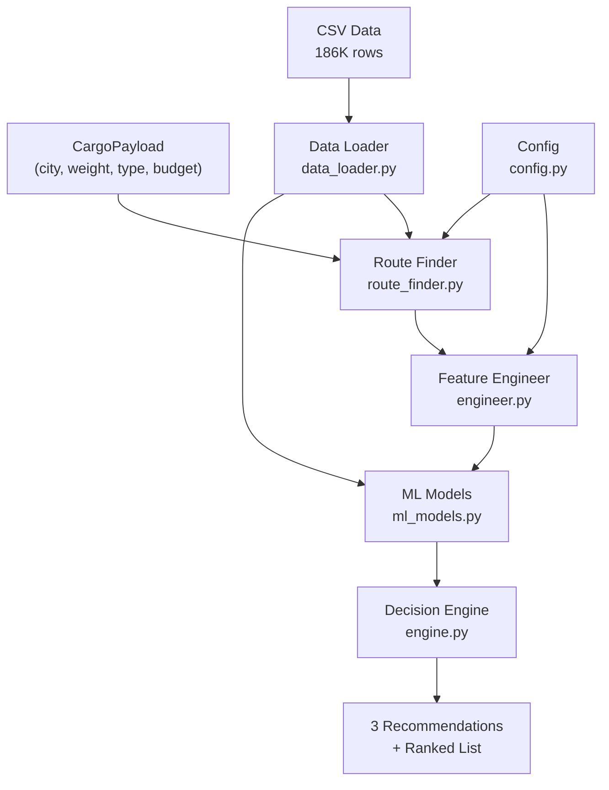

# Railway Cargo Decision Engine — Walkthrough

## What was built

A production-quality railway cargo decision engine that uses **real Indian Railways schedule data** (186K rows, 11,113 trains, 8,150 stations), ML-based risk prediction, and multi-objective optimization to recommend parcel train routes.

## Architecture



## Files Created/Modified

| File | Action | Purpose |
|------|--------|---------|
| [config.py](file:///Users/ojas/Desktop/LogiFlow-Solution-Challenge-2026/backend/app/pipelines/rail/config.py) | NEW | Parcel rates, 70+ city-station mappings, cargo constraints |
| [data_loader.py](file:///Users/ojas/Desktop/LogiFlow-Solution-Challenge-2026/backend/app/pipelines/rail/data_loader.py) | NEW | CSV parser → route index (796K pairs) |
| [route_finder.py](file:///Users/ojas/Desktop/LogiFlow-Solution-Challenge-2026/backend/app/pipelines/rail/route_finder.py) | NEW | Direct + transfer route discovery |
| [engineer.py](file:///Users/ojas/Desktop/LogiFlow-Solution-Challenge-2026/backend/app/pipelines/rail/engineer.py) | NEW | Parcel cost, risk, booking ease, feasibility |
| [ml_models.py](file:///Users/ojas/Desktop/LogiFlow-Solution-Challenge-2026/backend/app/pipelines/rail/ml_models.py) | NEW | GBM delay (R²=0.93) + duration prediction |
| [engine.py](file:///Users/ojas/Desktop/LogiFlow-Solution-Challenge-2026/backend/app/pipelines/rail/engine.py) | NEW | Multi-objective optimizer |
| [pipeline.py](file:///Users/ojas/Desktop/LogiFlow-Solution-Challenge-2026/backend/app/pipelines/rail/pipeline.py) | REWRITTEN | RailPipeline + RailCargoOptimizer |
| [rail_routes.py](file:///Users/ojas/Desktop/LogiFlow-Solution-Challenge-2026/backend/app/routes/rail_routes.py) | NEW | FastAPI endpoints |
| [main.py](file:///Users/ojas/Desktop/LogiFlow-Solution-Challenge-2026/backend/app/main.py) | MODIFIED | Added rail_routes router |
| [requirements.txt](file:///Users/ojas/Desktop/LogiFlow-Solution-Challenge-2026/backend/requirements.txt) | MODIFIED | Added ML dependencies |
| [test.py](file:///Users/ojas/Desktop/LogiFlow-Solution-Challenge-2026/backend/app/pipelines/rail/test.py) | REWRITTEN | 6-phase comprehensive test |

## Test Results

```
══════════════════════════════════════════════════════
  RESULTS
══════════════════════════════════════════════════════

  Passed: 6/6
  Failed: 0/6

  🎉 ALL TESTS PASSED!
```

Key metrics:
- **11,113 trains** parsed from CSV
- **8,150 stations** indexed
- **796,531 direct route pairs** computed
- **ML Delay R²**: 0.93
- **Parcel pricing**: ₹8,884 for 300kg Mumbai→Delhi (realistic)

## Sample Output — Mumbai → Delhi, 300kg General Cargo

```
💰 CHEAPEST: SWARAJ EXPRESS — ₹8,862 | 20.7h | Risk: 75%
⚡ FASTEST:  AMRITSAR EXP   — ₹9,016 |  4.5h | Risk: 75%
🛡️ SAFEST:   NDLS DURONTO   — ₹8,873 | 17.2h | Risk: 46%

All options ranked (balanced score):
#1  NDLS DURONTO     ₹8,873   17.2h  risk:0.46  score:0.3010
#2  BCT NDLS BI      ₹8,873   15.9h  risk:0.50  score:0.3190
#3  FZR JANATA E     ₹8,873    5.3h  risk:0.75  score:0.3509
#4  SWARAJ EXPRE     ₹8,862   20.7h  risk:0.75  score:0.3528
#5  PASCHIM EXPR     ₹8,862   22.7h  risk:0.75  score:0.3717
```

## API Usage

```bash
# Full cargo optimization
curl -X POST http://localhost:8000/railway/optimize \
  -H "Content-Type: application/json" \
  -d '{
    "origin_city": "Mumbai",
    "destination_city": "Delhi",
    "cargo_weight_kg": 300,
    "cargo_type": "General",
    "budget_max_inr": 20000,
    "deadline_hours": 36,
    "priority": "cost",
    "departure_date": "2025-08-15"
  }'

# List available stations
curl http://localhost:8000/railway/stations

# List cargo type constraints
curl http://localhost:8000/railway/cargo-types

# ML model info
curl http://localhost:8000/railway/model-info

# Existing optimize endpoint still works (now with real rail data)
curl -X POST http://localhost:8000/optimize \
  -H "Content-Type: application/json" \
  -d '{"source":"Mumbai","destination":"Delhi","priority":"Fast"}'
```
