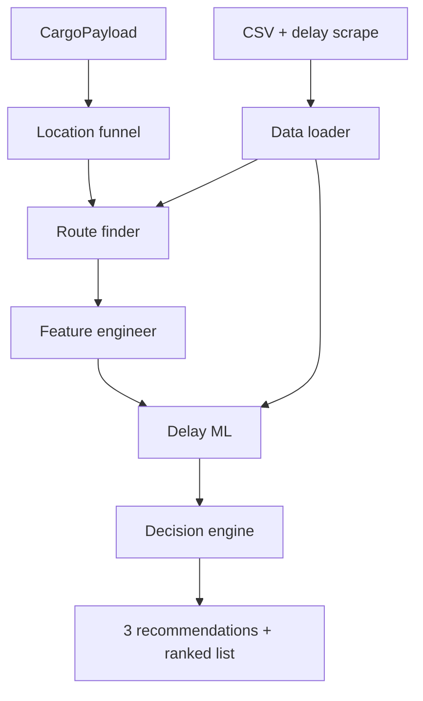

# Railway Cargo Decision Engine — Walkthrough

## What is implemented

A railway cargo optimizer using real Indian Railways schedule data, scraped delay labels, parcel tariff math, and multi-objective ranking (cheapest / fastest / safest).

## Architecture


```mermaid
graph TD
    A["CargoPayload"] --> B["Location funnel"]
    B --> C["Route finder"]
    C --> D["Feature engineer"]
    D --> E["Delay ML"]
    E --> F["Decision engine"]
    F --> G["3 recommendations + ranked list"]

    H["CSV + delay scrape"] --> I["Data loader"]
    I --> C
    I --> E
```

## Key modules

| File | Purpose |
|------|---------|
| `config.py` | Parcel rates, city-station mappings |
| `data_loader.py` | Lazy CSV index (796k direct pairs) |
| `route_finder.py` | Direct + transfer discovery via station clusters |
| `engineer.py` | Tariff, risk, booking ease |
| `scraped_delay_ml.py` | GBM training on `ir_train_delays.csv` |
| `ml_models.py` | Inference + fast `get_model_info()` for UI |
| `geometry_builder.py` | Per-train corridor stops + polyline |
| `pipeline.py` | `RailPipeline.generate()` entry |

## ML metrics (current corpus)

Trained on **15,650** train-day rows from scraped runningstatus.in history:

| Metric | Value |
|--------|-------|
| CV MAE | 22.7 min |
| ±15 min hit rate | 59.3% |
| ±30 min hit rate | 80.9% |
| Backtest ±30 min (3-day mean) | 80.1% |

Train: `make train-delay-ml`  
Sync to Supabase: `make sync-rail-ml-metrics`  
UI reads Supabase first (no Render cold start).

## Map geometry

- Built per train leg from that train's schedule halts
- Cached in Supabase `train_route_geometry`
- Audited with `make audit-rail-geometry TRAINS=100` (schedule vs map; 82/100 pass)

## API

```bash
# Cargo optimization
curl -X POST http://localhost:8000/railway/optimize \
  -H "Content-Type: application/json" \
  -d '{"source":"Mumbai","destination":"Delhi","weight_kg":300,"cargo_type":"general"}'

# ML metrics (also in Supabase rail_ml_metrics)
curl http://localhost:8000/railway/model-info

# Corridor geometry
curl "http://localhost:8000/railway/trains/12303/geometry?from_code=NDLS&to_code=HWH"
```
