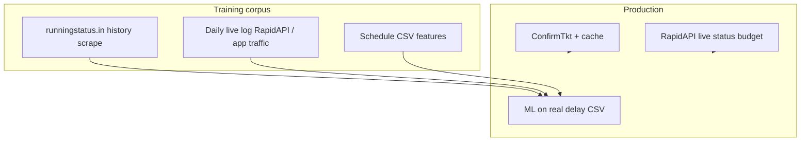

# Indian Railways data ecosystem (LogiFlow)

There is **no official public IR API with unlimited rate limits**. CRIS/NTES/IRCTC protect live data with firewalls, CAPTCHAs, and partner licenses. LogiFlow must use a **tiered strategy**, not naive bulk scraping of government sites.

## Category 1 — Official ground truth (strict limits)

| Source | Role | LogiFlow use |
|--------|------|----------------|
| **NTES** (enquiry.indianrail.gov.in) | Live running status master | Do not bulk-scrape; highest block risk |
| **IRCTC** (irctc.co.in) | Booking + schedule changes | Optional session fallback in `railradar_client` (bot detection) |
| **CRIS** (cris.org.in) | Commercial feeds | Enterprise license only — not in repo |
| **indianrailways.gov.in** | Timetables, year books | Features only (`Train_details_22122017.csv`, data.gov.in) |

**Training labels:** Official sites rarely expose **historical per-stop delay CSVs**. Timetable ≠ delay history.

## Category 2 — Aggregators (cached NTES proxies)

These cache NTES/IRCTC for human traffic. They **will rate-limit** scripted bulk access:

- Where Is My Train, RailYatri, Trainman, ixigo, ConfirmTkt, RailMitra, MakeMyTrip, **runningstatus.in**

**LogiFlow today:**

- **ConfirmTkt** — primary trains-between-stations scrape (`railradar_client`)
- **runningstatus.in** — `scripts/collect_ir_delay_history.py` for **historical** train/day pages (polite, resumable)

Use aggregators for **research datasets**, not production firehose without permission.

## Category 3 — Developer paths (volume without burning one IP)

| Method | Notes | LogiFlow |
|--------|-------|----------|
| **RapidAPI IRCTC proxies** (e.g. irctc1.p.rapidapi.com) | Paid tiers = higher quota; keys rotate in pool | Set `IRCTC_RAPIDAPI_KEY` / `IRCTC_RAPIDAPI_KEYS`; enable with `ENABLE_IRCTC_RAPIDAPI=true` for **live** endpoints only |
| **IRCTC Connect** (signed third-party) | `IRCTC_CONNECT_API_KEYS` + secret | Optional; off by default in code |
| **Community SDKs + residential proxies** | Not bundled — legal/ops risk | Out of scope |
| **Apify / ScrapingBee actors** | Distributed scrape | Optional external ETL → import CSV |

**Reality:** Historical 3-month delay for all trains is **~1M requests**. No free tier supports that. Strategy = **slow history scrape + daily live logging + paid API for hot paths**.

## Recommended LogiFlow data plan



1. **History (3 months):** `make collect-delays` → `backend/data/ir_delay_scrape/ir_train_delays.csv` (resumable, weeks of runtime).
2. **Live ground truth:** Enable RapidAPI keys; collector `--strategy live-today` for today’s snapshot only (quota-aware).
3. **Ongoing:** Log delays from every `get_live_status` / optimize call into the same CSV (best production labels).
4. **Retrain:** `scripts/train_rail_ml.py` on minute-level delays — retire `on_time_rating` proxy.

## Environment variables

```bash
# RapidAPI pool (live status, fares — NOT unlimited on free tier)
IRCTC_RAPIDAPI_KEYS=key1,key2
ENABLE_IRCTC_RAPIDAPI=true

# Optional IRCTC Connect
IRCTC_CONNECT_API_KEYS=irctc_...
IRCTC_CONNECT_SDK_SECRET=...

# Collector
COLLECT_IR_STRATEGY=history          # history | live-today | hybrid
COLLECT_IR_SLEEP_SEC=1.25
RAIL_WEB_SCRAPE_ENABLED=false        # custom template only if you have one
```

## What we do not claim

- Scraping “the entire internet” or every train globally
- Unlimited NTES access without CRIS partnership
- European rail datasets for Indian delay models (different operations)

## Files

| Path | Purpose |
|------|---------|
| `backend/scripts/collect_ir_delay_history.py` | Resumable IR delay CSV builder |
| `backend/scripts/scrapers/runningstatus.py` | runningstatus.in parser |
| `backend/scripts/scrapers/rapidapi_live.py` | Today-only RapidAPI snapshot |
| `backend/app/pipelines/rail/railradar_client.py` | Live + search providers |
| `backend/data/ir_delay_scrape/README.md` | Runbook + scale estimates |
