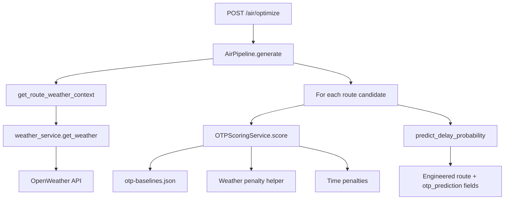

# Air OTP Congestion Scoring

This document describes how LogiFlow computes **On-Time Performance (OTP) congestion scores** for the air cargo pipeline using existing weather integration and checked-in baseline data.

**API:** `POST /air/optimize` · **Frontend:** `/air` · **Pipeline:** `backend/app/pipelines/air/pipeline.py`

---

## Overview

When a user searches for an air route (`POST /air/optimize`), each returned flight includes:

| Field | Type | Description |
|-------|------|-------------|
| `otp_prediction` | object | Full scoring breakdown |
| `congestion_score` | int | 0–100 congestion index |
| `congestion_level` | string | `Low` / `Medium` / `High` / `Critical` |
| `congestion_risk` | float | `1 - adjustedOTP` (used in delay probability) |

The scoring reuses **OpenWeather** via the existing `weather_service` → `air_weather_service` chain. No new weather API integration was added.

---

## Architecture



### Key files

| File | Role |
|------|------|
| `backend/app/services/otp_scoring_service.py` | `OTPScoringService`, penalty helpers |
| `backend/data/otp-baselines.json` | Airport OTP baselines |
| `backend/app/services/weather_service.py` | OpenWeather fetch (existing) |
| `backend/app/services/air_weather_service.py` | Route weather context (existing) |
| `backend/app/pipelines/air/ml_models.py` | Calls OTP scoring per route |
| `backend/app/pipelines/air/pipeline.py` | Attaches fields to API response |
| `backend/tests/test_otp_scoring_service.py` | Unit tests |
| `backend/tests/test_air_otp_integration.py` | Pipeline integration test |

---

## OTPScoringService

### Input

```python
service.score(
    departure_airport="DEL",           # IATA code
    departure_time="2026-04-10T08:30", # ISO date or datetime
    weather_data={                     # From existing weather API
        "condition": "Rain",
        "temp": 28,
        "rain": 2.5,
    },
    inbound_delay_minutes=0,           # Optional connecting delay
)
```

### Output

```json
{
  "baselineOTP": 0.81,
  "adjustedOTP": 0.74,
  "congestionScore": 26,
  "congestionLevel": "Medium",
  "factors": {
    "baselineSource": "airport_month",
    "weatherPenalty": 0.05,
    "peakHourPenalty": 0.03,
    "weekendPenalty": 0.0,
    "inboundDelayPenalty": 0.0,
    "departureHour": 8,
    "departureWeekday": "Friday",
    "weatherCondition": "Rain"
  }
}
```

---

## Baseline lookup (`otp-baselines.json`)

Lookup order:

1. **Airport month OTP** — `airports.DEL.byMonth["4"]`
2. **Airport default OTP** — `airports.DEL.defaultOTP`
3. **Global default OTP** — `globalDefaultOTP` (0.76)

Regenerate baselines from DGCA reports via ETL when available. File path override: `OTP_BASELINES_PATH`.

---

## Weather penalties

Uses the **existing** OpenWeather `condition` field (`weather[].main`).

| Condition | Penalty |
|-----------|---------|
| Clear | 0.00 |
| Clouds | 0.02 |
| Drizzle | 0.04 |
| Rain | 0.05 |
| Thunderstorm | 0.12 |
| Fog / Mist / Haze | 0.10 |

Helper: `weather_penalty_from_api_response(weather_data)` in `otp_scoring_service.py`.

Weather is fetched once per city via `get_route_weather_context()`; the **departure city** weather drives OTP scoring for outbound flights.

---

## Additional penalties

| Factor | Rule | Penalty |
|--------|------|---------|
| Peak hour | 07:00–10:00 or 17:00–21:00 | 0.03 |
| Weekend | Saturday / Sunday | 0.01 |
| Inbound delay | `min(minutes / 100, 0.10)` | up to 0.10 |

---

## Scoring formula

```
adjustedOTP = baselineOTP
            - weatherPenalty
            - peakHourPenalty
            - weekendPenalty
            - inboundDelayPenalty

adjustedOTP = clamp(adjustedOTP, 0, 1)

congestionScore = round((1 - adjustedOTP) * 100)
```

### Congestion levels

| Score | Level |
|-------|-------|
| 0–20 | Low |
| 21–40 | Medium |
| 41–60 | High |
| 61+ | Critical |

---

## Air pipeline integration

Injection point: `AirPipeline._engineer_features()` in `pipeline.py`.

For each OpenFlights route candidate:

1. Fetch weather context once: `get_route_weather_context(source, destination)`
2. Call `predict_delay_probability()` in `ml_models.py`
3. Inside `ml_models`, `score_route_otp()` runs `OTPScoringService.score()`
4. Results attached to route:

```python
{
    "otp_prediction": { ... },
    "congestion_score": 26,
    "congestion_level": "Medium",
    "congestion_risk": 0.26,
}
```

`congestion_risk` feeds the composite delay probability and overall route risk score.

---

## Frontend

`AirResults.tsx` displays an **OTP congestion** panel with baseline/adjusted OTP, level badge, weather condition, and departure time context.

Types: `AirOtpPrediction` in `frontend/src/services/api.ts`.

---

## Testing

From repo root:

```bash
make test-otp-scoring
```

Or manually:

```powershell
cd c:\Users\Lenovo\Desktop\LogiFlow-Solution-Challenge-2026\backend
$env:PYTHONPATH='.'
python -m unittest discover -s tests -p "test_otp*.py" -v
python -m unittest discover -s tests -p "test_air_otp*.py" -v
```

API smoke test (backend running):

```powershell
curl -X POST http://127.0.0.1:8000/air/optimize `
  -H "Content-Type: application/json" `
  -d '{"source":"Delhi","destination":"Mumbai","priority":"fast","departure_date":"2026-04-10","cargo_weight_kg":500,"cargo_type":"general"}'
```

Inspect `ranked_routes[0].otp_prediction`, `congestion_score`, `congestion_level`.

---

## Environment

| Variable | Purpose |
|----------|---------|
| `OPENWEATHER_API_KEY` | Existing — live weather (fallback: Clear if missing) |
| `OTP_BASELINES_PATH` | Optional override for baselines JSON |

---

## Future improvements

- ETL from [DGCA OTP reports](https://www.dgca.gov.in/) into `otp-baselines.json`
- Hub inbound delay for one-stop routes from upstream leg OTP
- Dedicated `/air/otp-score` debug endpoint for judges/demo
- Align `air_weather_service._condition_penalty` with OTP penalties if unified risk is desired
