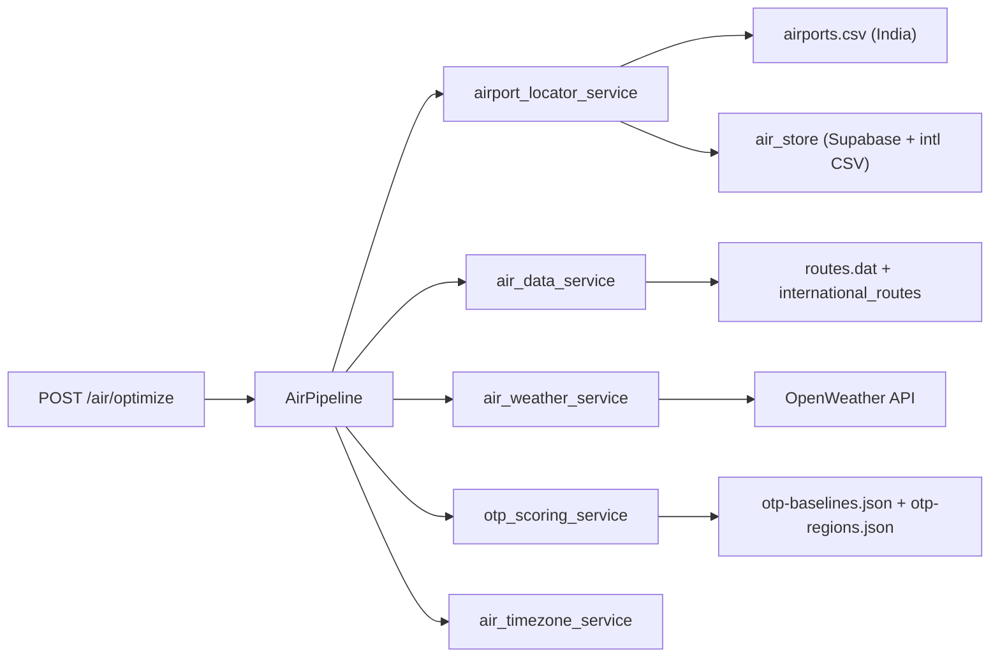
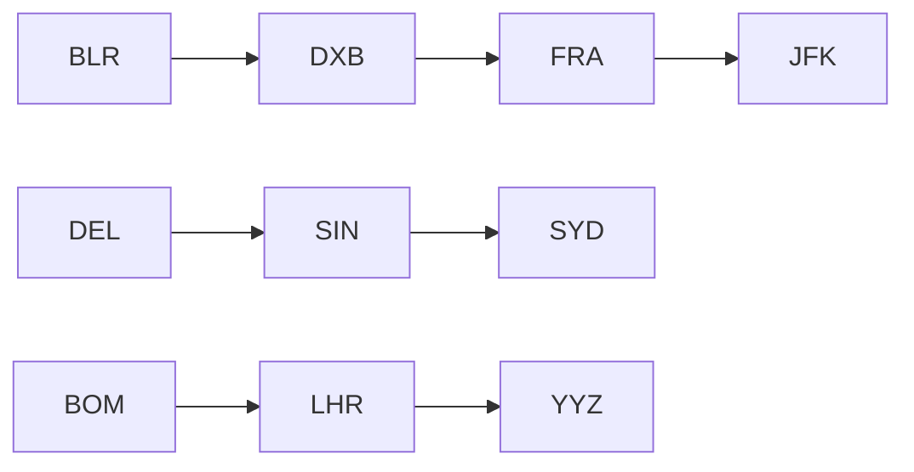

# International Air Cargo Routing

## 1. Overview

LogiFlow's air pipeline optimizes cargo routes using OpenFlights route support, OTP congestion scoring, OpenWeather integration, and a scoring-based ranking engine. This document describes how the system was extended from **India-only** corridors to **worldwide** support while preserving backward compatibility with existing APIs, Indian routes, and frontend integrations.

## 2. Existing Architecture



**Key files:**

| Component | Path |
|-----------|------|
| API | `backend/app/routes/air_routes.py` |
| Pipeline | `backend/app/pipelines/air/pipeline.py` |
| Route graph | `backend/app/services/air_data_service.py` |
| Airport lookup | `backend/app/services/airport_locator_service.py` |
| Supabase store | `backend/app/services/air_store.py` |
| Weather | `backend/app/services/weather_service.py` |
| OTP | `backend/app/services/otp_scoring_service.py` |
| Timezone | `backend/app/services/air_timezone_service.py` |

## 3. Why Internationalization Was Required

The original implementation filtered OurAirports and OpenFlights data to `iso_country == "IN"`, hardcoded eight Indian metros, queried weather by city name, and assumed implicit IST for peak-hour OTP penalties. That design worked for domestic Indian cargo but could not resolve corridors such as BLR→DXB→FRA→JFK or DEL→FRA without code changes.

Internationalization adds:

- Global airport reference data (Supabase + offline hub CSV)
- Coordinate-based weather for any airport
- Regional OTP baselines with airport-specific overrides
- International hub route edges merged into the existing graph
- Timezone-aware scheduling (UTC internally, local for display/OTP)

## 4. Airport Dataset Source

**Primary source:** [OurAirports](https://ourairports.com/data/airports.csv)

Fields mapped to Supabase `airports`:

| OurAirports | Supabase column |
|-------------|-----------------|
| `iata_code` | `iata` |
| `ident` / `gps_code` | `icao` |
| `name` | `airport_name` |
| `municipality` | `city` |
| `iso_country` | `country` (expanded name) |
| `latitude_deg` | `latitude` |
| `longitude_deg` | `longitude` |
| derived via `geo-tz` | `timezone` |

Only airports with valid 3-letter IATA codes and scheduled service are imported.

## 5. Dataset Import Process

### Supabase (production)

```bash
cd scripts
npm install
SUPABASE_URL=... SUPABASE_KEY=... npm run seed:airports
SUPABASE_URL=... SUPABASE_KEY=... npm run seed:routes
```

### Offline fallback (CI / no Supabase)

Checked-in files under `backend/data/`:

- `international_airports.csv` — major hub airports with timezone
- `international_routes.csv` — cargo hub edges
- `otp-regions.json` — regional and international OTP baselines

The existing India snapshot (`airports.csv`, `routes.dat`) is **unchanged** and still powers domestic routes.

## 6. Supabase Schema Changes

Migrations in `supabase/migrations/`:

### `airports`

```sql
id, iata, icao, airport_name, city, country,
latitude, longitude, timezone, created_at
```

Indexes: `iata` (unique), `city`, `country`

### `air_routes`

```sql
source_iata, destination_iata, distance_km, duration_hours
```

Unique on `(source_iata, destination_iata)`.

### `otp_baselines`

```sql
airport_iata, otp_score, region, updated_at
```

Airport rows have `airport_iata` set; regional/global rows use `region` with null `airport_iata`.

## 7. Airport Lookup Flow

```
Input (city name or IATA code)
  → IATA pattern? → Supabase / international CSV / India CSV
  → CITY_ALIASES + CITY_TO_AIRPORT (Indian + major international cities)
  → geocode (India-first, then global Nominatim)
  → nearest airport within threshold
  → fallback synthetic code
```

Indian cities (Delhi, Mumbai, etc.) resolve exactly as before via static map + `airports.csv`.

International examples:

| Input | Resolved IATA |
|-------|---------------|
| `Dubai` | DXB |
| `JFK` | JFK |
| `Frankfurt` | FRA |
| `Singapore` | SIN |

## 8. Weather Integration Updates

**Before:** `get_weather("Mumbai")` — city name query only.

**After:** `get_weather_by_coords(lat, lng)` when airport coordinates are known; city query retained as fallback.

`air_weather_service.get_route_weather_context()` resolves both endpoints to airports first, then fetches weather by coordinates. Existing OpenWeather API key and response shape are unchanged.

Supported worldwide examples: BLR, DXB, FRA, JFK, LHR, SIN.

## 9. OTP Baseline Logic

Lookup priority (unchanged for Indian month-level data):

1. **Airport month** — `otp-baselines.json` `byMonth` (Indian airports)
2. **Airport default** — `otp-baselines.json` `defaultOTP`
3. **Airport baseline** — `otp-regions.json` or Supabase `otp_baselines`
4. **Region baseline** — IN, ME, EU, NA, APAC
5. **Global default** — 0.76

Congestion formula is unchanged:

```
adjustedOTP = baseline - weather - peak - weekend - inbound
congestionScore = round((1 - adjustedOTP) * 100)
```

Peak-hour windows (07–10, 17–21) now use **departure airport local time** via `air_timezone_service`.

## 10. Route Graph Architecture

The graph merges three edge sources:

1. **OpenFlights** — `backend/data/routes.dat` (India intra-country, unchanged)
2. **International CSV** — `backend/data/international_routes.csv`
3. **Supabase** — `air_routes` table (when configured)



One-stop hub selection logic is **unchanged**: intersection of outgoing/incoming sets, haversine path sanity check, top 3 hubs by distance and degree.

## 11. Timezone Handling

All duration math uses UTC. Display fields are additive on `air_details`:

| Field | Description |
|-------|-------------|
| `departure_utc` | ISO 8601 UTC departure |
| `arrival_utc` | UTC arrival (departure + duration) |
| `departure_local` | Local time at source airport |
| `arrival_local` | Local time at destination airport |
| `schedule` | Object containing all four timestamps + timezone names |

Timezone source: `airport.timezone` from Supabase or `international_airports.csv`. Indian CSV airports default to `Asia/Kolkata`.

Example: DEL 10:00 IST → FRA 14:30 CET internally stored as UTC pair.

## 12. API Compatibility Guarantees

`POST /air/optimize` request and response structure are **unchanged**. Additive fields only:

- `air_details.schedule`
- `air_details.departure_local`, `arrival_local`, `departure_utc`, `arrival_utc`

Existing fields preserved: `best_route`, `alternatives`, `ranked_routes`, `otp_prediction`, `congestion_score`, `congestion_level`, `cost_breakdown` (INR), etc.

`no_routes` status behavior unchanged (HTTP 200).

## 13. Migration Process

1. Apply Supabase migrations:

   ```bash
   supabase db push
   # or run SQL files in supabase/migrations/ manually
   ```

2. Seed data:

   ```bash
   cd scripts && npm install
   SUPABASE_URL=... SUPABASE_KEY=... npm run seed:all
   ```

3. Set environment variables on backend (optional — falls back to CSV):

   ```
   SUPABASE_URL=...
   SUPABASE_KEY=...   # or SUPABASE_ANON_KEY
   OPENWEATHER_API_KEY=...
   ```

4. Restart backend. No frontend changes required.

## 14. Seeding Process

| Script | Responsibility |
|--------|----------------|
| `scripts/seedAirports.js` | Download OurAirports, filter IATA, derive timezone, upsert `airports` |
| `scripts/seedRoutes.js` | Upsert `air_routes` from CSV + `otp_baselines` from JSON |

Both scripts log import statistics and corridor spot-checks.

## 15. Testing Strategy

```bash
cd backend
PYTHONPATH=. python -m unittest discover -s tests -p "test_*air*.py" -v
PYTHONPATH=. python -m unittest discover -s tests -p "test_otp*.py" -v
python scripts/verify_air_data.py
```

Coverage:

- Airport lookup (Indian + international + IATA input)
- Coordinate weather
- OTP baseline priority
- Timezone conversion
- Route graph (BLR→DXB, DEL→FRA, JFK→LHR, SIN→SYD, BOM→JFK)
- Pipeline response shape
- DEL→BOM regression

## 16. Example Requests

```json
POST /air/optimize
{
  "source": "Bengaluru",
  "destination": "Dubai",
  "priority": "balanced",
  "departure_date": "2026-04-10",
  "cargo_weight_kg": 500,
  "cargo_type": "general"
}
```

```json
POST /air/optimize
{
  "source": "Delhi",
  "destination": "Frankfurt",
  "priority": "fast",
  "departure_date": "2026-04-10T10:00:00"
}
```

## 17. Example Responses

Success (abbreviated):

```json
{
  "mode": "air",
  "best_route": {
    "type": "Air",
    "stops": 0,
    "distance": 6100,
    "time": 9.07,
    "congestion_score": 22,
    "congestion_level": "Medium",
    "air_details": {
      "source_airport": { "code": "DEL", "timezone": "Asia/Kolkata" },
      "destination_airport": { "code": "FRA", "timezone": "Europe/Berlin" },
      "departure_local": "2026-04-10T10:00:00+0530",
      "departure_utc": "2026-04-10T04:30:00+0000",
      "arrival_local": "2026-04-10T14:32:00+0200",
      "arrival_utc": "2026-04-10T12:32:00+0000",
      "schedule": { "...": "..." }
    }
  },
  "total_routes": 1
}
```

## 18. Future Improvements

- Live commercial schedule API integration (currently OpenFlights + hub graph only)
- DGCA / Eurocontrol OTP ETL replacing approximate baselines
- Full global `routes.dat` snapshot instead of hub-edge subset
- Unified weather penalty model (route risk vs OTP penalty)
- Hub inbound delay propagation for one-stop OTP scoring
- Frontend map overlay for international corridors
